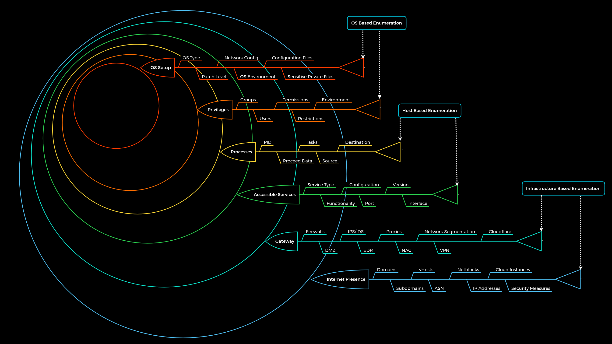

# Enumeration

Enumeration is a widely used term in cyber security. It stands for information gathering using active (scans) and passive (use of third-party providers) methods. It is important to note that OSINT is an independent procedure and should be performed separately from enumeration because OSINT is based exclusively on passive information gathering and does not involve active enumeration of the given target. Enumeration is a loop in which we repeatedly gather information based on what data we have or have already discovered.


## Principles

The enumeration principles are based on some questions that will facilitate all our investigations in any conceivable situation. In most cases, the main focus of many penetration testers is on what they can see and not on what they cannot see. However, even what we cannot see is relevant to us and may well be of great importance. The difference here is that we start to see the components and aspects that are not visible at first glance with our experience.

- What can we see?
- What reasons can we have for seeing it?
- What image does what we see create for us?
- What do we gain from it?
- How can we use it?
- What can we not see?
- What reasons can there be that we do not see?
- What image results for us from what we do not see?

And our principles:

|No.|Principle|
|---|---------|
|1.|There is more than meets the eye. Consider all points of view.|
|2.|Distinguish between what we see and what we do not see.|
|3.|There are always ways to gain more information. Understand the target.|


## Methodology

We know that penetration testing, and therefore enumeration, is a dynamic process. Consequently, we have developed a static enumeration methodology for external and internal penetration tests that includes free dynamics and allows for a wide range of changes and adaptations to the given environment. This methodology is nested in 6 layers and represents, metaphorically speaking, boundaries that we try to pass with the enumeration process. The whole enumeration process is divided into three different levels:



|Layer|Description|Information Categories|
|-----|-----------|----------------------|
|1. Internet Presence|Identification of internet presence and externally accessible infrastructure.|Domains, Subdomains, vHosts, ASN, Netblocks, IP Addresses, Cloud Instances, Security Measures|
|2. Gateway|Identify the possible security measures to protect the company's external and internal infrastructure.|Firewalls, DMZ, IPS/IDS, EDR, Proxies, NAC, Network Segmentation, VPN, Cloudflare|
|3. Accessible Services|Identify accessible interfaces and services that are hosted externally or internally.|Service Type, Functionality, Configuration, Port, Version, Interface|
|4. Processes|Identify the internal processes, sources, and destinations associated with the services.|PID, Processed Data, Tasks, Source, Destination|
|5. Privileges|Identification of the internal permissions and privileges to the accessible services.|Groups, Users, Permissions, Restrictions, Environment|
|6. OS Setup|Identification of the internal components and systems setup.|OS Type, Patch Level, Network config, OS Environment, Configuration files, sensitive private files|
 
### Layer No.1: Internet Presence

The first layer we have to pass is the "Internet Presence" layer, where we focus on finding the targets we can investigate. If the scope in the contract allows us to look for additional hosts, this layer is even more critical than for fixed targets only. In this layer, we use different techniques to find domains, subdomains, netblocks, and many other components and information that present the presence of the company and its infrastructure on the Internet.
  
 *The goal of this layer is to identify all possible target systems and interfaces that can be tested.*

### Layer No.2: Gateway

Here we try to understand the interface of the reachable target, how it is protected, and where it is located in the network. Due to the diversity, different functionalities, and some particular procedures, we will go into more detail about this layer in other modules.
 
 *The goal is to understand what we are dealing with and what we have to watch out for.*

### Layer No.3: Accessible Services

In the case of accessible services, we examine each destination for all the services it offers. Each of these services has a specific purpose that has been installed for a particular reason by the administrator. Each service has certain functions, which therefore also lead to specific results. To work effectively with them, we need to know how they work. Otherwise, we need to learn to understand them.

 *This layer aims to understand the reason and functionality of the target system and gain the necessary knowledge to communicate with it and exploit it for our purposes effectively.*

### Layer No.4: Processes

Every time a command or function is executed, data is processed, whether entered by the user or generated by the system. This starts a process that has to perform specific tasks, and such tasks have at least one source and one target.

 *The goal here is to understand these factors and identify the dependencies between them.*

### Layer No.5: Privileges

Each service runs through a specific user in a particular group with permissions and privileges defined by the administrator or the system. These privileges often provide us with functions that administrators overlook. This often happens in Active Directory infrastructures and many other case-specific administration environments and servers where users are responsible for multiple administration areas.

*It is crucial to identify these and understand what is and is not possible with these privileges.*

### Layer No.6: OS Setup

Here we collect information about the actual operating system and its setup u sing internal access. This gives us a good overview of the internal security of the systems and reflects the skills and capabilities of the company's administrative teams.

*The goal here is to see how the administrators manage the systems and what sensitive internal information we can glean from them.*


## Domain Information

Domain information is a core component of any penetration test, and it is not just about the subdomains but about the entire presence on the Internet. Therefore, we gather information and try to understand the company's functionality and which technologies and structures are necessary for services to be offered successfully and efficiently.

### Online Presence

The first point of presence on the Internet may be the SSL certificate from the company's main website that we can examine. Often, such a certificate includes more than just a subdomain, and this means that the certificate is used for several domains, and these are most likely still active.

Another source to find more subdomains is crt.sh. This source is Certificate Transparency logs. Certificate Transparency is a process that is intended to enable the verification of issued digital certificates for encrypted Internet connections. The standard (RFC 6962) provides for the logging of all digital certificates issued by a certificate authority in audit-proof logs. This is intended to enable the detection of false or maliciously issued certificates for a domain. SSL certificate providers like Let's Encrypt share this with the web interface crt.sh, which stores the new entries in the database to be accessed later.

Using crt.sh
> curl -s https://crt.sh/\?q\=inlanefreight.com\&output\=json | jq .

If needed, we can also have them filtered by the unique subdomains.
> curl -s https://crt.sh/\?q\=inlanefreight.com\&output\=json | jq . | grep name | cut -d":" -f2 | grep -v "CN=" | cut -d'"' -f2 | awk '{gsub(/\\n/,"\n");}1;' | sort -u

### Company Hosted Servers

> for i in $(cat subdomainlist);do host $i | grep "has address" | grep inlanefreight.com | cut -d" " -f1,4;done

### Shodan - IP List

Shodan can be used on web and cli
```
frank-106@htb[/htb]$ for i in $(cat subdomainlist);do host $i | grep "has address" | grep inlanefreight.com | cut -d" " -f4 >> ip-addresses.txt;done
frank-106@htb[/htb]$ for i in $(cat ip-addresses.txt);do shodan host $i;done
```

### DNS Records

> dig any inlanefreight.com


## Cloud Resources

Even though cloud providers secure their infrastructure centrally, this does not mean that companies are free from vulnerabilities. The configurations made by the administrators may nevertheless make the company's cloud resources vulnerable. This often starts with the S3 buckets (AWS), blobs (Azure), cloud storage (GCP), which can be accessed without authentication if configured incorrectly.

### Company Hosted Servers

Often cloud storage is added to the DNS list when used for administrative purposes by other employees. This step makes it much easier for the employees to reach and manage them. Let us stay with the case that a company has contracted us, and during the IP lookup, we have already seen that one IP address belongs to the s3-website-us-west-2.amazonaws.com server.

```
frank-106@htb[/htb]$ for i in $(cat subdomainlist);do host $i | grep "has address" | grep inlanefreight.com | cut -d" " -f1,4;done

blog.inlanefreight.com 10.129.24.93
inlanefreight.com 10.129.27.33
matomo.inlanefreight.com 10.129.127.22
www.inlanefreight.com 10.129.127.33
s3-website-us-west-2.amazonaws.com 10.129.95.250
```