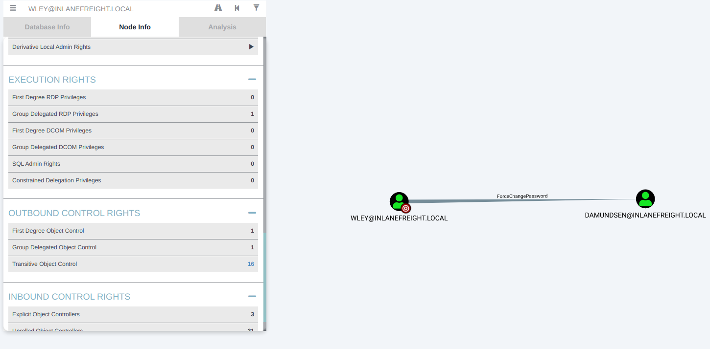
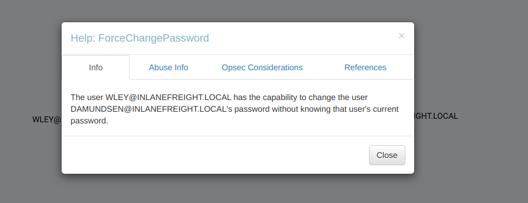
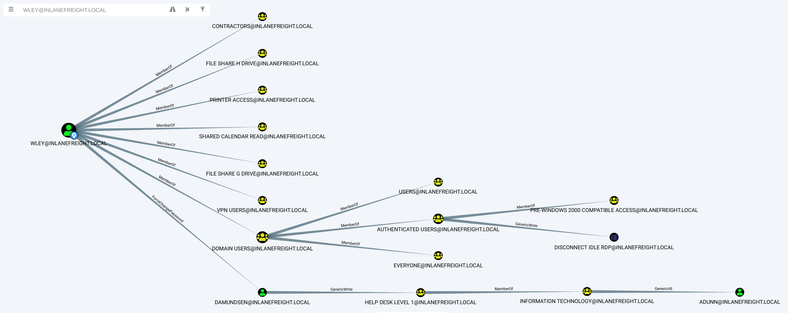

# ACL Enumeration

---

Let's jump into enumerating ACLs using PowerView and walking through some graphical representations using BloodHound. We will then cover a few scenarios/attacks where the ACEs we enumerate can be leveraged to gain us further access in the internal environment.

---

## Enumerating ACLs with PowerView

We can use PowerView to enumerate ACLs, but the task of digging through _all_ of the results will be extremely time-consuming and likely inaccurate. For example, if we run the function `Find-InterestingDomainAcl` we will receive a massive amount of information back that we would need to dig through to make any sense of:

#### Using Find-InterestingDomainAcl

ACL Enumeration

```powershell-session
PS C:\htb> Find-InterestingDomainAcl

ObjectDN                : DC=INLANEFREIGHT,DC=LOCAL
AceQualifier            : AccessAllowed
ActiveDirectoryRights   : ExtendedRight
ObjectAceType           : ab721a53-1e2f-11d0-9819-00aa0040529b
AceFlags                : ContainerInherit
AceType                 : AccessAllowedObject
InheritanceFlags        : ContainerInherit
SecurityIdentifier      : S-1-5-21-3842939050-3880317879-2865463114-5189
IdentityReferenceName   : Exchange Windows Permissions
IdentityReferenceDomain : INLANEFREIGHT.LOCAL
IdentityReferenceDN     : CN=Exchange Windows Permissions,OU=Microsoft Exchange Security 
                          Groups,DC=INLANEFREIGHT,DC=LOCAL
IdentityReferenceClass  : group

ObjectDN                : DC=INLANEFREIGHT,DC=LOCAL
AceQualifier            : AccessAllowed
ActiveDirectoryRights   : ExtendedRight
ObjectAceType           : 00299570-246d-11d0-a768-00aa006e0529
AceFlags                : ContainerInherit
AceType                 : AccessAllowedObject
InheritanceFlags        : ContainerInherit
SecurityIdentifier      : S-1-5-21-3842939050-3880317879-2865463114-5189
IdentityReferenceName   : Exchange Windows Permissions
IdentityReferenceDomain : INLANEFREIGHT.LOCAL
IdentityReferenceDN     : CN=Exchange Windows Permissions,OU=Microsoft Exchange Security 
                          Groups,DC=INLANEFREIGHT,DC=LOCAL
IdentityReferenceClass  : group

<SNIP>
```

If we try to dig through all of this data during a time-boxed assessment, we will likely never get through it all or find anything interesting before the assessment is over. Now, there is a way to use a tool such as PowerView more effectively -- by performing targeted enumeration starting with a user that we have control over. Let's focus on the user `wley`, which we obtained after solving the last question in the `LLMNR/NBT-NS Poisoning - from Linux` section. Let's dig in and see if this user has any interesting ACL rights that we could take advantage of. We first need to get the SID of our target user to search effectively.

ACL Enumeration

```powershell-session
PS C:\htb> Import-Module .\PowerView.ps1
PS C:\htb> $sid = Convert-NameToSid wley
```

We can then use the `Get-DomainObjectACL` function to perform our targeted search. In the below example, we are using this function to find all domain objects that our user has rights over by mapping the user's SID using the `$sid` variable to the `SecurityIdentifier` property which is what tells us _who_ has the given right over an object. One important thing to note is that if we search without the flag `ResolveGUIDs`, we will see results like the below, where the right `ExtendedRight` does not give us a clear picture of what ACE entry the user `wley` has over `damundsen`. This is because the `ObjectAceType` property is returning a GUID value that is not human readable.

Note that this command will take a while to run, especially in a large environment. It may take 1-2 minutes to get a result in our lab.

#### Using Get-DomainObjectACL

ACL Enumeration

```powershell-session
PS C:\htb> Get-DomainObjectACL -Identity * | ? {$_.SecurityIdentifier -eq $sid}

ObjectDN               : CN=Dana Amundsen,OU=DevOps,OU=IT,OU=HQ-NYC,OU=Employees,OU=Corp,DC=INLANEFREIGHT,DC=LOCAL
ObjectSID              : S-1-5-21-3842939050-3880317879-2865463114-1176
ActiveDirectoryRights  : ExtendedRight
ObjectAceFlags         : ObjectAceTypePresent
ObjectAceType          : 00299570-246d-11d0-a768-00aa006e0529
InheritedObjectAceType : 00000000-0000-0000-0000-000000000000
BinaryLength           : 56
AceQualifier           : AccessAllowed
IsCallback             : False
OpaqueLength           : 0
AccessMask             : 256
SecurityIdentifier     : S-1-5-21-3842939050-3880317879-2865463114-1181
AceType                : AccessAllowedObject
AceFlags               : ContainerInherit
IsInherited            : False
InheritanceFlags       : ContainerInherit
PropagationFlags       : None
AuditFlags             : None
```

We could Google for the GUID value `00299570-246d-11d0-a768-00aa006e0529` and uncover [this](https://docs.microsoft.com/en-us/windows/win32/adschema/r-user-force-change-password) page showing that the user has the right to force change the other user's password. Alternatively, we could do a reverse search using PowerShell to map the right name back to the GUID value.

#### Performing a Reverse Search & Mapping to a GUID Value

ACL Enumeration

```powershell-session
PS C:\htb> $guid= "00299570-246d-11d0-a768-00aa006e0529"
PS C:\htb> Get-ADObject -SearchBase "CN=Extended-Rights,$((Get-ADRootDSE).ConfigurationNamingContext)" -Filter {ObjectClass -like 'ControlAccessRight'} -Properties * |Select Name,DisplayName,DistinguishedName,rightsGuid| ?{$_.rightsGuid -eq $guid} | fl

Name              : User-Force-Change-Password
DisplayName       : Reset Password
DistinguishedName : CN=User-Force-Change-Password,CN=Extended-Rights,CN=Configuration,DC=INLANEFREIGHT,DC=LOCAL
rightsGuid        : 00299570-246d-11d0-a768-00aa006e0529
```

This gave us our answer, but would be highly inefficient during an assessment. PowerView has the `ResolveGUIDs` flag, which does this very thing for us. Notice how the output changes when we include this flag to show the human-readable format of the `ObjectAceType` property as `User-Force-Change-Password`.

#### Using the -ResolveGUIDs Flag

ACL Enumeration

```powershell-session
PS C:\htb> Get-DomainObjectACL -ResolveGUIDs -Identity * | ? {$_.SecurityIdentifier -eq $sid} 

AceQualifier           : AccessAllowed
ObjectDN               : CN=Dana Amundsen,OU=DevOps,OU=IT,OU=HQ-NYC,OU=Employees,OU=Corp,DC=INLANEFREIGHT,DC=LOCAL
ActiveDirectoryRights  : ExtendedRight
ObjectAceType          : User-Force-Change-Password
ObjectSID              : S-1-5-21-3842939050-3880317879-2865463114-1176
InheritanceFlags       : ContainerInherit
BinaryLength           : 56
AceType                : AccessAllowedObject
ObjectAceFlags         : ObjectAceTypePresent
IsCallback             : False
PropagationFlags       : None
SecurityIdentifier     : S-1-5-21-3842939050-3880317879-2865463114-1181
AccessMask             : 256
AuditFlags             : None
IsInherited            : False
AceFlags               : ContainerInherit
InheritedObjectAceType : All
OpaqueLength           : 0
```

`Why did we walk through this example when we could have just searched using ResolveGUIDs first?`

It is essential that we understand what our tools are doing and have alternative methods in our toolkit in case a tool fails or is blocked. Before moving on, let's take a quick look at how we could do this using the [Get-Acl](https://docs.microsoft.com/en-us/powershell/module/microsoft.powershell.security/get-acl?view=powershell-7.2) and [Get-ADUser](https://docs.microsoft.com/en-us/powershell/module/activedirectory/get-aduser?view=windowsserver2022-ps) cmdlets which we may find available to us on a client system. Knowing how to perform this type of search without using a tool such as PowerView is greatly beneficial and could set us apart from our peers. We may be able to use this knowledge to achieve results when a client has us work from one of their systems, and we are restricted down to what tools are readily available on the system without the ability to pull in any of our own.

This example is not very efficient, and the command can take a long time to run, especially in a large environment. It will take much longer than the equivalent command using PowerView. In this command, we've first made a list of all domain users with the following command:

#### Creating a List of Domain Users

ACL Enumeration

```powershell-session
PS C:\htb> Get-ADUser -Filter * | Select-Object -ExpandProperty SamAccountName > ad_users.txt
```

We then read each line of the file using a `foreach` loop, and use the `Get-Acl` cmdlet to retrieve ACL information for each domain user by feeding each line of the `ad_users.txt` file to the `Get-ADUser` cmdlet. We then select just the `Access property`, which will give us information about access rights. Finally, we set the `IdentityReference` property to the user we are in control of (or looking to see what rights they have), in our case, `wley`.

#### A Useful foreach Loop

ACL Enumeration

```powershell-session
PS C:\htb> foreach($line in [System.IO.File]::ReadLines("C:\Users\htb-student\Desktop\ad_users.txt")) {get-acl  "AD:\$(Get-ADUser $line)" | Select-Object Path -ExpandProperty Access | Where-Object {$_.IdentityReference -match 'INLANEFREIGHT\\wley'}}

Path                  : Microsoft.ActiveDirectory.Management.dll\ActiveDirectory:://RootDSE/CN=Dana 
                        Amundsen,OU=DevOps,OU=IT,OU=HQ-NYC,OU=Employees,OU=Corp,DC=INLANEFREIGHT,DC=LOCAL
ActiveDirectoryRights : ExtendedRight
InheritanceType       : All
ObjectType            : 00299570-246d-11d0-a768-00aa006e0529
InheritedObjectType   : 00000000-0000-0000-0000-000000000000
ObjectFlags           : ObjectAceTypePresent
AccessControlType     : Allow
IdentityReference     : INLANEFREIGHT\wley
IsInherited           : False
InheritanceFlags      : ContainerInherit
PropagationFlags      : None
```

Once we have this data, we could follow the same methods shown above to convert the GUID to a human-readable format to understand what rights we have over the target user.

So, to recap, we started with the user `wley` and now have control over the user `damundsen` via the `User-Force-Change-Password` extended right. Let's use Powerview to hunt for where, if anywhere, control over the `damundsen` account could take us.

#### Further Enumeration of Rights Using damundsen

ACL Enumeration

```powershell-session
PS C:\htb> $sid2 = Convert-NameToSid damundsen
PS C:\htb> Get-DomainObjectACL -ResolveGUIDs -Identity * | ? {$_.SecurityIdentifier -eq $sid2} -Verbose

AceType               : AccessAllowed
ObjectDN              : CN=Help Desk Level 1,OU=Security Groups,OU=Corp,DC=INLANEFREIGHT,DC=LOCAL
ActiveDirectoryRights : ListChildren, ReadProperty, GenericWrite
OpaqueLength          : 0
ObjectSID             : S-1-5-21-3842939050-3880317879-2865463114-4022
InheritanceFlags      : ContainerInherit
BinaryLength          : 36
IsInherited           : False
IsCallback            : False
PropagationFlags      : None
SecurityIdentifier    : S-1-5-21-3842939050-3880317879-2865463114-1176
AccessMask            : 131132
AuditFlags            : None
AceFlags              : ContainerInherit
AceQualifier          : AccessAllowed
```

Now we can see that our user `damundsen` has `GenericWrite` privileges over the `Help Desk Level 1` group. This means, among other things, that we can add any user (or ourselves) to this group and inherit any rights that this group has applied to it. A search for rights conferred upon this group does not return anything interesting.

Let's look and see if this group is nested into any other groups, remembering that nested group membership will mean that any users in group A will inherit all rights of any group that group A is nested into (a member of). A quick search shows us that the `Help Desk Level 1` group is nested into the `Information Technology` group, meaning that we can obtain any rights that the `Information Technology` group grants to its members if we just add ourselves to the `Help Desk Level 1` group where our user `damundsen` has `GenericWrite` privileges.

#### Investigating the Help Desk Level 1 Group with Get-DomainGroup

ACL Enumeration

```powershell-session
PS C:\htb> Get-DomainGroup -Identity "Help Desk Level 1" | select memberof

memberof                                                                      
--------                                                                      
CN=Information Technology,OU=Security Groups,OU=Corp,DC=INLANEFREIGHT,DC=LOCAL
```

This is a lot to digest! Let's recap where we're at:

- We have control over the user `wley` whose hash we retrieved earlier in the module (assessment) using Responder and cracked offline using Hashcat to reveal the cleartext password value
- We enumerated objects that the user `wley` has control over and found that we could force change the password of the user `damundsen`
- From here, we found that the `damundsen` user can add a member to the `Help Desk Level 1` group using `GenericWrite` privileges
- The `Help Desk Level 1` group is nested into the `Information Technology` group, which grants members of that group any rights provisioned to the `Information Technology` group

Now let's look around and see if members of `Information Technology` can do anything interesting. Once again, doing our search using `Get-DomainObjectACL` shows us that members of the `Information Technology` group have `GenericAll` rights over the user `adunn`, which means we could:

- Modify group membership
- Force change a password
- Perform a targeted Kerberoasting attack and attempt to crack the user's password if it is weak

#### Investigating the Information Technology Group

ACL Enumeration

```powershell-session
PS C:\htb> $itgroupsid = Convert-NameToSid "Information Technology"
PS C:\htb> Get-DomainObjectACL -ResolveGUIDs -Identity * | ? {$_.SecurityIdentifier -eq $itgroupsid} -Verbose

AceType               : AccessAllowed
ObjectDN              : CN=Angela Dunn,OU=Server Admin,OU=IT,OU=HQ-NYC,OU=Employees,OU=Corp,DC=INLANEFREIGHT,DC=LOCAL
ActiveDirectoryRights : GenericAll
OpaqueLength          : 0
ObjectSID             : S-1-5-21-3842939050-3880317879-2865463114-1164
InheritanceFlags      : ContainerInherit
BinaryLength          : 36
IsInherited           : False
IsCallback            : False
PropagationFlags      : None
SecurityIdentifier    : S-1-5-21-3842939050-3880317879-2865463114-4016
AccessMask            : 983551
AuditFlags            : None
AceFlags              : ContainerInherit
AceQualifier          : AccessAllowed

```

Finally, let's see if the `adunn` user has any type of interesting access that we may be able to leverage to get closer to our goal.

#### Looking for Interesting Access

ACL Enumeration

```powershell-session
PS C:\htb> $adunnsid = Convert-NameToSid adunn 
PS C:\htb> Get-DomainObjectACL -ResolveGUIDs -Identity * | ? {$_.SecurityIdentifier -eq $adunnsid} -Verbose

AceQualifier           : AccessAllowed
ObjectDN               : DC=INLANEFREIGHT,DC=LOCAL
ActiveDirectoryRights  : ExtendedRight
ObjectAceType          : DS-Replication-Get-Changes-In-Filtered-Set
ObjectSID              : S-1-5-21-3842939050-3880317879-2865463114
InheritanceFlags       : ContainerInherit
BinaryLength           : 56
AceType                : AccessAllowedObject
ObjectAceFlags         : ObjectAceTypePresent
IsCallback             : False
PropagationFlags       : None
SecurityIdentifier     : S-1-5-21-3842939050-3880317879-2865463114-1164
AccessMask             : 256
AuditFlags             : None
IsInherited            : False
AceFlags               : ContainerInherit
InheritedObjectAceType : All
OpaqueLength           : 0

AceQualifier           : AccessAllowed
ObjectDN               : DC=INLANEFREIGHT,DC=LOCAL
ActiveDirectoryRights  : ExtendedRight
ObjectAceType          : DS-Replication-Get-Changes
ObjectSID              : S-1-5-21-3842939050-3880317879-2865463114
InheritanceFlags       : ContainerInherit
BinaryLength           : 56
AceType                : AccessAllowedObject
ObjectAceFlags         : ObjectAceTypePresent
IsCallback             : False
PropagationFlags       : None
SecurityIdentifier     : S-1-5-21-3842939050-3880317879-2865463114-1164
AccessMask             : 256
AuditFlags             : None
IsInherited            : False
AceFlags               : ContainerInherit
InheritedObjectAceType : All
OpaqueLength           : 0

<SNIP>
```

The output above shows that our `adunn` user has `DS-Replication-Get-Changes` and `DS-Replication-Get-Changes-In-Filtered-Set` rights over the domain object. This means that this user can be leveraged to perform a DCSync attack. We will cover this attack in-depth in the `DCSync` section.

---

## Enumerating ACLs with BloodHound

Now that we've enumerated the attack path using more manual methods like PowerView and built-in PowerShell cmdlets, let's look at how much easier this would have been to identify using the extremely powerful BloodHound tool. Let's take the data we gathered earlier with the SharpHound ingestor and upload it to BloodHound. Next, we can set the `wley` user as our starting node, select the `Node Info` tab and scroll down to `Outbound Control Rights`. This option will show us objects we have control over directly, via group membership, and the number of objects that our user could lead to us controlling via ACL attack paths under `Transitive Object Control`. If we click on the `1` next to `First Degree Object Control`, we see the first set of rights that we enumerated, `ForceChangePassword` over the `damundsen` user.

#### Viewing Node Info through BloodHound



If we right-click on the line between the two objects, a menu will pop up. If we select `Help`, we will be presented with help around abusing this ACE, including:

- More info on the specific right, tools, and commands that can be used to pull off this attack
- Operational Security (Opsec) considerations
- External references.

We'll dig into this menu more later on.

#### Investigating ForceChangePassword Further



If we click on the `16` next to `Transitive Object Control`, we will see the entire path that we painstakingly enumerated above. From here, we could leverage the help menus for each edge to find ways to best pull off each attack.

#### Viewing Potential Attack Paths through BloodHound



Finally, we can use the pre-built queries in BloodHound to confirm that the `adunn` user has DCSync rights.

#### Viewing Pre-Build queries through BloodHound


We've now enumerated these attack paths in multiple ways. The next step will be performing this attack chain from start to finish. Let's dig in!