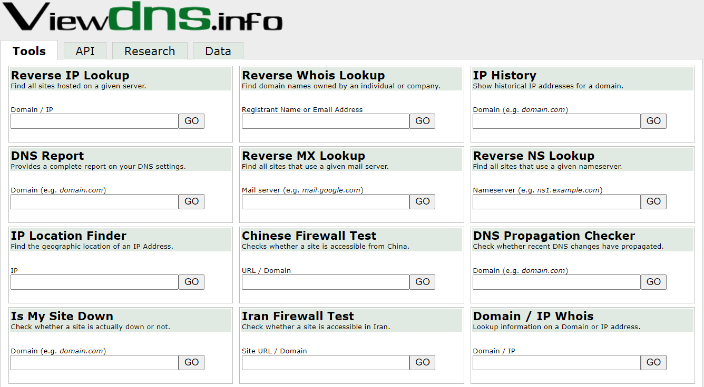
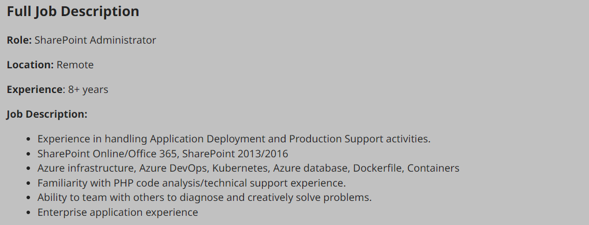
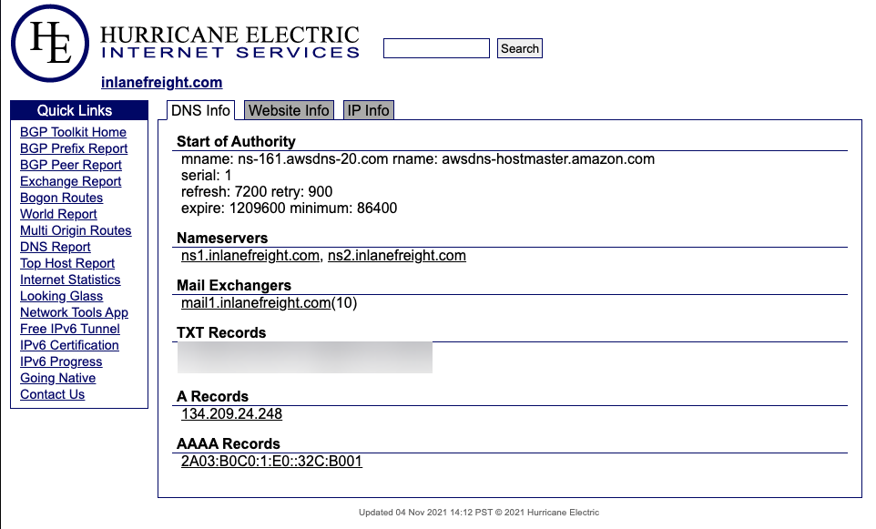
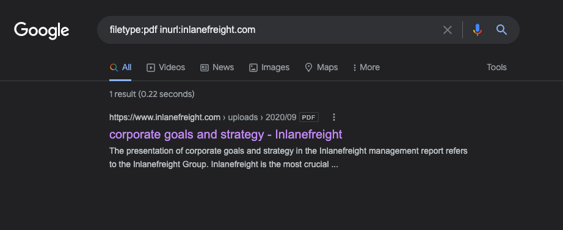
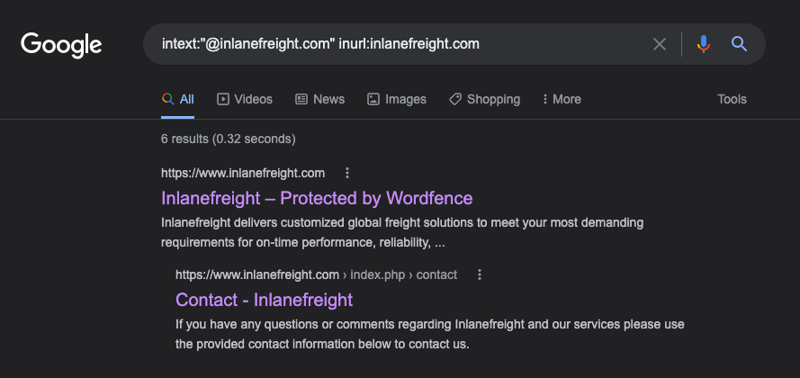
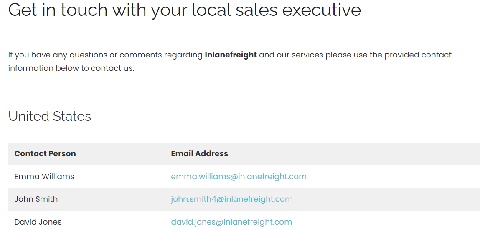

# External Recon and Enumeration Principles

---

Before kicking off any pentest, it can be beneficial to perform `external reconnaissance` of your target. This can serve many different functions, such as:

- Validating information provided to you in the scoping document from the client
- Ensuring you are taking actions against the appropriate scope when working remotely
- Looking for any information that is publicly accessible that can affect the outcome of your test, such as leaked credentials

Think of it like this; we are trying to get the `lay of the land` to ensure we provide the most comprehensive test possible for our customer. That also means identifying any potential information leaks and breach data out in the world. This can be as simple as gleaning a username format from the customer's main website or social media. We may also dive as deep as scanning GitHub repositories for credentials left in code pushes, hunting in documents for links to an intranet or remotely accessible sites, and just looking for any information that can key us in on how the enterprise environment is configured.

---

## What Are We Looking For?

When conducting our external reconnaissance, there are several key items that we should be looking for. This information may not always be publicly accessible, but it would be prudent to see what is out there. If we get stuck during a penetration test, looking back at what could be obtained through passive recon can give us that nudge needed to move forward, such as password breach data that could be used to access a VPN or other externally facing service. The table below highlights the "`What`" in what we would be searching for during this phase of our engagement.

| **Data Point** | **Description** |
| --- | --- |
| `IP Space` | Valid ASN for our target, netblocks in use for the organization's public-facing infrastructure, cloud presence and the hosting providers, DNS record entries, etc. |
| `Domain Information` | Based on IP data, DNS, and site registrations. Who administers the domain? Are there any subdomains tied to our target? Are there any publicly accessible domain services present? (Mailservers, DNS, Websites, VPN portals, etc.) Can we determine what kind of defenses are in place? (SIEM, AV, IPS/IDS in use, etc.) |
| `Schema Format` | Can we discover the organization's email accounts, AD usernames, and even password policies? Anything that will give us information we can use to build a valid username list to test external-facing services for password spraying, credential stuffing, brute forcing, etc. |
| `Data Disclosures` | For data disclosures we will be looking for publicly accessible files ( .pdf, .ppt, .docx, .xlsx, etc. ) for any information that helps shed light on the target. For example, any published files that contain `intranet` site listings, user metadata, shares, or other critical software or hardware in the environment (credentials pushed to a public GitHub repo, the internal AD username format in the metadata of a PDF, for example.) |
| `Breach Data` | Any publicly released usernames, passwords, or other critical information that can help an attacker gain a foothold. |

We have addressed the `why` and `what` of external reconnaissance; let's dive into the `where` and `how`.

---

## Where Are We Looking?

Our list of data points above can be gathered in many different ways. There are many different websites and tools that can provide us with some or all of the information above that we could use to obtain information vital to our assessment. The table below lists a few potential resources and examples that can be used.

| **Resource** | **Examples** |
| --- | --- |
| `ASN / IP registrars` | [IANA](https://www.iana.org/), [arin](https://www.arin.net/) for searching the Americas, [RIPE](https://www.ripe.net/) for searching in Europe, [BGP Toolkit](https://bgp.he.net/) |
| `Domain Registrars & DNS` | [Domaintools](https://www.domaintools.com/), [PTRArchive](http://ptrarchive.com/), [ICANN](https://lookup.icann.org/lookup), manual DNS record requests against the domain in question or against well known DNS servers, such as `8.8.8.8`. |
| `Social Media` | Searching Linkedin, Twitter, Facebook, your region's major social media sites, news articles, and any relevant info you can find about the organization. |
| `Public-Facing Company Websites` | Often, the public website for a corporation will have relevant info embedded. News articles, embedded documents, and the "About Us" and "Contact Us" pages can also be gold mines. |
| `Cloud & Dev Storage Spaces` | [GitHub](https://github.com/), [AWS S3 buckets & Azure Blog storage containers](https://grayhatwarfare.com/), [Google searches using "Dorks"](https://www.exploit-db.com/google-hacking-database) |
| `Breach Data Sources` | [HaveIBeenPwned](https://haveibeenpwned.com/) to determine if any corporate email accounts appear in public breach data, [Dehashed](https://www.dehashed.com/) to search for corporate emails with cleartext passwords or hashes we can try to crack offline. We can then try these passwords against any exposed login portals (Citrix, RDS, OWA, 0365, VPN, VMware Horizon, custom applications, etc.) that may use AD authentication. |

### Finding Address Spaces


The `BGP-Toolkit` hosted by [Hurricane Electric](http://he.net/) is a fantastic resource for researching what address blocks are assigned to an organization and what ASN they reside within. Just punch in a domain or IP address, and the toolkit will search for any results it can. We can glean a lot from this info. Many large corporations will often self-host their infrastructure, and since they have such a large footprint, they will have their own ASN. This will typically not be the case for smaller organizations or fledgling companies. As you research, keep this in mind since smaller organizations will often host their websites and other infrastructure in someone else's space (Cloudflare, Google Cloud, AWS, or Azure, for example). Understanding where that infrastructure resides is extremely important for our testing. We have to ensure we are not interacting with infrastructure out of our scope. If we are not careful while pentesting against a smaller organization, we could end up inadvertently causing harm to another organization sharing that infrastructure. You have an agreement to test with the customer, not with others on the same server or with the provider. Questions around self-hosted or 3rd party managed infrastructure should be handled during the scoping process and be clearly listed in any scoping documents you receive.

In some cases, your client may need to get written approval from a third-party hosting provider before you can test. Others, such as AWS, have specific [guidelines](https://aws.amazon.com/security/penetration-testing/) for performing penetration tests and do not require prior approval for testing some of their services. Others, such as Oracle, ask you to submit a [Cloud Security Testing Notification](https://docs.oracle.com/en-us/iaas/Content/Security/Concepts/security_testing-policy_notification.htm). These types of steps should be handled by your company management, legal team, contracts team, etc. If you are in doubt, escalate before attacking any external-facing services you are unsure of during an assessment. It is our responsibility to ensure that we have explicit permission to attack any hosts (both internal and external), and stopping and clarifying the scope in writing never hurts.

### DNS

DNS is a great way to validate our scope and find out about reachable hosts the customer did not disclose in their scoping document. Sites like [domaintools](https://whois.domaintools.com/), and [viewdns.info](https://viewdns.info/) are great spots to start. We can get back many records and other data ranging from DNS resolution to testing for DNSSEC and if the site is accessible in more restricted countries. Sometimes we may find additional hosts out of scope, but look interesting. In that case, we could bring this list to our client to see if any of them should indeed be included in the scope. We may also find interesting subdomains that were not listed in the scoping documents, but reside on in-scope IP addresses and therefore are fair game.

#### Viewdns.info



This is also a great way to validate some of the data found from our IP/ASN searches. Not all information about the domain found will be current, and running checks that can validate what we see is always good practice.

### Public Data

Social media can be a treasure trove of interesting data that can clue us in to how the organization is structured, what kind of equipment they operate, potential software and security implementations, their schema, and more. On top of that list are job-related sites like LinkedIn, Indeed.com, and Glassdoor. Simple job postings often reveal a lot about a company. For example, take a look at the job listing below. It's for a `SharePoint Administrator` and can key us in on many things. We can tell from the listing that the company has been using SharePoint for a while and has a mature program since they are talking about security programs, backup & disaster recovery, and more. What is interesting to us in this posting is that we can see the company likely uses SharePoint 2013 and SharePoint 2016. That means they may have upgraded in place, potentially leaving vulnerabilities in play that may not exist in newer versions. This also means we may run into different versions of SharePoint during our engagements.

### Sharepoint Admin Job Listing



Don't discount public information such as job postings or social media. You can learn a lot about an organization just from what they post, and a well-intentioned post could disclose data relevant to us as penetration testers.

Websites hosted by the organization are also great places to dig for information. We can gather contact emails, phone numbers, organizational charts, published documents, etc. These sites, specifically the embedded documents, can often have links to internal infrastructure or intranet sites that you would not otherwise know about. Checking any publicly accessible information for those types of details can be quick wins when trying to formulate a picture of the domain structure. With the growing use of sites such as GitHub, AWS cloud storage, and other web-hosted platforms, data can also be leaked unintentionally. For example, a dev working on a project may accidentally leave some credentials or notes hardcoded into a code release. If you know where to look for that data, it can give you an easy win. It could mean the difference between having to password spray and brute-force credentials for hours or days or gaining a quick foothold with developer credentials, which may also have elevated permissions. Tools like [Trufflehog](https://github.com/trufflesecurity/truffleHog) and sites like [Greyhat Warfare](https://buckets.grayhatwarfare.com/) are fantastic resources for finding these breadcrumbs.

We have spent some time discussing external enumeration and recon of an organization, but this is just one piece of the puzzle. For a more detailed introduction to OSINT and external enumeration, check out the [Footprinting](https://academy.hackthebox.com/course/preview/footprinting) and [OSINT:Corporate Recon](https://academy.hackthebox.com/course/preview/osint-corporate-recon) modules.

Up to this point, we have been mostly passive in our discussions. As you move forward into the pentest, you will become more hands-on, validating the information you have found and probing the domain for more information. Let's take a minute to discuss enumeration principles and how we can put a process in place to perform these actions.

---

## Overarching Enumeration Principles

Keeping in mind that our goal is to understand our target better, we are looking for every possible avenue we can find that will provide us with a potential route to the inside. Enumeration itself is an iterative process we will repeat several times throughout a penetration test. Besides the customer's scoping document, this is our primary source of information, so we want to ensure we are leaving no stone unturned. When starting our enumeration, we will first use `passive` resources, starting wide in scope and narrowing down. Once we exhaust our initial run of passive enumeration, we will need to examine the results and then move into our active enumeration phase.

---

## Example Enumeration Process

We have already covered quite a few concepts pertaining to enumeration. Let's start putting it all together. We will practice our enumeration tactics on the `inlanefreight.com` domain without performing any heavy scans (such as Nmap or vulnerability scans which are out of scope). We will start first by checking our Netblocks data and seeing what we can find.

#### Check for ASN/IP & Domain Data



From this first look, we have already gleaned some interesting info. BGP.he is reporting:

- IP Address: 134.209.24.248
- Mail Server: mail1.inlanefreight.com
- Nameservers: NS1.inlanefreight.com & NS2.inlanefreight.com

For now, this is what we care about from its output. Inlanefreight is not a large corporation, so we didn't expect to find that it had its own ASN. Now let's validate some of this information.

#### Viewdns Results


In the request above, we utilized `viewdns.info` to validate the IP address of our target. Both results match, which is a good sign. Now let's try another route to validate the two nameservers in our results.

External Recon and Enumeration Principles

```shell-session
frank-106@htb[/htb]$ nslookup ns1.inlanefreight.com

Server:		192.168.186.1
Address:	192.168.186.1#53

Non-authoritative answer:
Name:	ns1.inlanefreight.com
Address: 178.128.39.165

nslookup ns2.inlanefreight.com
Server:		192.168.86.1
Address:	192.168.86.1#53

Non-authoritative answer:
Name:	ns2.inlanefreight.com
Address: 206.189.119.186 
```

We now have `two` new IP addresses to add to our list for validation and testing. Before taking any further action with them, ensure they are in-scope for your test. For our purposes, the actual IP addresses would not be in scope for scanning, but we could passively browse any websites to hunt for interesting data. For now, that is it with enumerating domain information from DNS. Let's take a look at the publicly available information.

Inlanefreight is a fictitious company that we are using for this module, so there is no real social media presence. However, we would check sites like LinkedIn, Twitter, Instagram, and Facebook for helpful info if it were real. Instead, we will move on to examining the website `inlanefreight.com`.

The first check we ran was looking for any documents. Using `filetype:pdf inurl:inlanefreight.com` as a search, we are looking for PDFs.

#### Hunting For Files



One document popped up, so we need to ensure we note the document and its location and download a copy locally to dig through. It is always best to save files, screenshots, scan output, tool output, etc., as soon as we come across them or generate them. This helps us keep as comprehensive a record as possible and not risk forgetting where we saw something or losing critical data. Next, let's look for any email addresses we can find.

#### Hunting E-mail Addresses



Using the dork `intext:"@inlanefreight.com" inurl:inlanefreight.com`, we are looking for any instance that appears similar to the end of an email address on the website. One promising result came up with a contact page. When we look at the page (pictured below), we can see a large list of employees and contact info for them. This information can be helpful since we can determine that these people are at least most likely active and still working with the company.

#### E-mail Dork Results

Browsing the [contact page](https://www.inlanefreight.com/index.php/contact/), we can see several emails for staff in different offices around the globe. We now have an idea of their email naming convention (first.last) and where some people work in the organization. This could be handy in later password spraying attacks or if social engineering/phishing were part of our engagement scope.



#### Username Harvesting

We can use a tool such as [linkedin2username](https://github.com/initstring/linkedin2username) to scrape data from a company's LinkedIn page and create various mashups of usernames (flast, first.last, f.last, etc.) that can be added to our list of potential password spraying targets.

#### Credential Hunting

[Dehashed](http://dehashed.com/) is an excellent tool for hunting for cleartext credentials and password hashes in breach data. We can search either on the site or using a script that performs queries via the API. Typically we will find many old passwords for users that do not work on externally-facing portals that use AD auth (or internal), but we may get lucky! This is another tool that can be useful for creating a user list for external or internal password spraying.

Note: For our purposes, the sample data below is fictional.

External Recon and Enumeration Principles

```shell-session
frank-106@htb[/htb]$ sudo python3 dehashed.py -q inlanefreight.local -p

id : 5996447501
email : roger.grimes@inlanefreight.local
username : rgrimes
password : Ilovefishing!
hashed_password : 
name : Roger Grimes
vin : 
address : 
phone : 
database_name : ModBSolutions

id : 7344467234
email : jane.yu@inlanefreight.local
username : jyu
password : Starlight1982_!
hashed_password : 
name : Jane Yu
vin : 
address : 
phone : 
database_name : MyFitnessPal

<SNIP>
```

Now that we have a hang of this try your hand at searching for other results related to the inlanefreight.com domain. What can you find? Are there any other useful files, pages, or information embedded on the site? This section demonstrated the importance of thoroughly analyzing our target, provided that we stay in scope and do not test anything we are not authorized to and stay within the time constraints of the engagement. I have had quite a few assessments where I was having trouble gaining a foothold from an anonymous standpoint on the internal network and resorted to creating a wordlist using varying outside sources (Google, LinkedIn scraping, Dehashed, etc.) and then performed targeted internal password spraying to get valid credentials for a standard domain user account. As we will see in the following sections, we can perform the vast majority of our internal AD enumeration with just a set of low-privilege domain user credentials and even many attacks. The fun starts once we have a set of credentials. Let's move into internal enumeration and begin analyzing the internal `INLANEFREIGHT.LOCAL` domain passively and actively per our assessment's scope and rules of engagement.