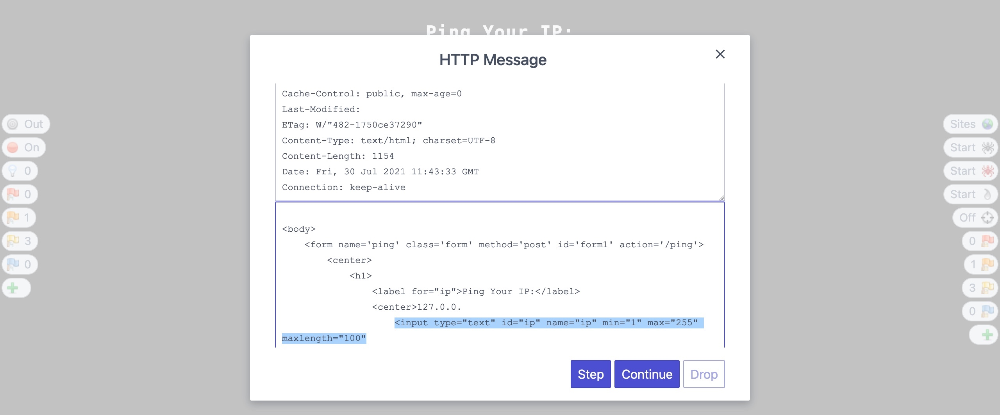

# Intercepting Responses

In some instances, we may need to intercept the HTTP responses from the server before they reach the browser. This can be useful when we want to change how a specific web page looks, like enabling certain disabled fields or showing certain hidden fields, which may help us in our penetration testing activities.

So, let's see how we can achieve that with the exercise we tested in the previous section.

In our previous exercise, the `IP` field only allowed us to input numeric values. If we intercept the response before it reaches our browser, we can edit it to accept any value, which would enable us to input the payload we used last time directly.

## Burp

In Burp, we can enable response interception by going to (`Proxy>Options`) and enabling `Intercept Response` under `Intercept Server Responses`:


After that, we can enable request interception once more and refresh the page with \[`CTRL+SHIFT+R`\] in our browser (to force a full refresh). When we go back to Burp, we should see the intercepted request, and we can click on `forward`. Once we forward the request, we'll see our intercepted response:


Let's try changing the `type="number"` on line 27 to `type="text"`, which should enable us to write any value we want. We will also change the `maxlength="3"` to `maxlength="100"` so we can enter longer input:

Code: html

```html
<input type="text" id="ip" name="ip" min="1" max="255" maxlength="100"
    oninput="javascript: if (this.value.length > this.maxLength) this.value = this.value.slice(0, this.maxLength);"
    required>
```

Now, once we click on `forward` again, we can go back to Firefox to examine the edited response:

As we can see, we could change the way the page is rendered by the browser and can now input any value we want. We may use the same technique to persistently enable any disabled HTML buttons by modifying their HTML code.

Exercise: Try using the payload we used last time directly within the browser, to test how intercepting responses can make web application penetration testing easier.


## ZAP

Let's try to see how we can do the same with ZAP. As we saw in the previous section, when our requests are intercepted by ZAP, we can click on `Step`, and it will send the request and automatically intercept the response:



Once we make the same changes we previously did and click on `Continue`, we will see that we can also use any input value.

However, ZAP HUD also has another powerful feature that can help us in cases like this. While in many instances we may need to intercept the response to make custom changes, if all we wanted was to enable disabled input fields or show hidden input fields, then we can click on the third button on the left (the light bulb icon), and it will enable/show these fields without us having to intercept the response or refresh the page.

For example, the below web application has the `IP` input field as disabled:

In these cases, we can click on the `Show/Enable` button, and it will enable the button for us, and we can interact with it to add our input:

We can similarly use this feature to show all hidden fields or buttons. `Burp` also has a similar feature, which we can enable under `Proxy>Options>Response Modification`, then select one of the options, like `Unhide hidden form fields`.

Another similar feature is the `Comments` button, which will indicate the positions where there are HTML comments that are usually only visible in the source code. We can click on the `+` button on the left pane and select `Comments` to add the `Comments` button, and once we click on it, the `Comments` indicators should be shown. For example, the below screenshot shows an indicator for a position that has a comment, and hovering over it with our cursor shows the comment's content:

Being able to modify how the web page looks makes it much easier for us to perform web application penetration testing in certain scenarios instead of having to send our input through an intercepted request. Next, we will see how we can automate this process to modify our changes in the response automatically so we don't have to keep intercepting and manually changing the responses.