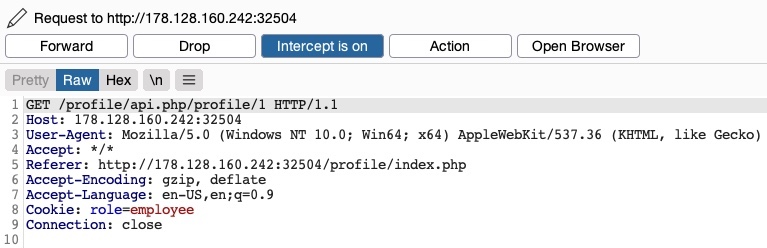
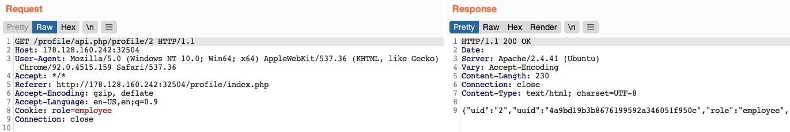
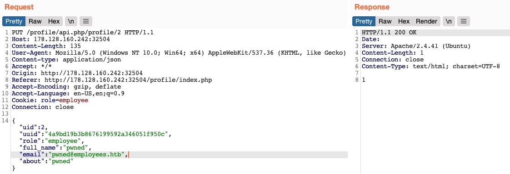
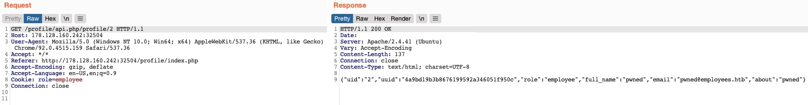
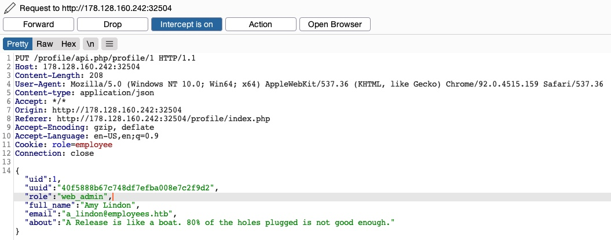
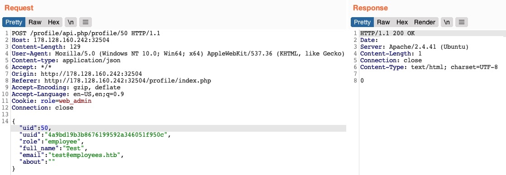

# Chaining IDOR Vulnerabilities

---

Usually, a `GET` request to the API endpoint should return the details of the requested user, so we may try calling it to see if we can retrieve our user's details. We also notice that after the page loads, it fetches the user details with a `GET` request to the same API endpoint: 

As mentioned in the previous section, the only form of authorization in our HTTP requests is the `role=employee` cookie, as the HTTP request does not contain any other form of user-specific authorization, like a JWT token, for example. Even if a token did exist, unless it was being actively compared to the requested object details by a back-end access control system, we may still be able to retrieve other users' details.

---

## Information Disclosure

Let's send a `GET` request with another `uid`:



As we can see, this returned the details of another user, with their own `uuid` and `role`, confirming an `IDOR Information Disclosure vulnerability`:

Code: json

```json
{
    "uid": "2",
    "uuid": "4a9bd19b3b8676199592a346051f950c",
    "role": "employee",
    "full_name": "Iona Franklyn",
    "email": "i_franklyn@employees.htb",
    "about": "It takes 20 years to build a reputation and few minutes of cyber-incident to ruin it."
}
```

This provides us with new details, most notably the `uuid`, which we could not calculate before, and thus could not change other users' details.

---

## Modifying Other Users' Details

Now, with the user's `uuid` at hand, we can change this user's details by sending a `PUT` request to `/profile/api.php/profile/2` with the above details along with any modifications we made, as follows:



We don't get any access control error messages this time, and when we try to `GET` the user details again, we see that we did indeed update their details:



In addition to allowing us to view potentially sensitive details, the ability to modify another user's details also enables us to perform several other attacks. One type of attack is `modifying a user's email address` and then requesting a password reset link, which will be sent to the email address we specified, thus allowing us to take control over their account. Another potential attack is `placing an XSS payload in the 'about' field`, which would get executed once the user visits their `Edit profile` page, enabling us to attack the user in different ways.

---

## Chaining Two IDOR Vulnerabilities

Since we have identified an IDOR Information Disclosure vulnerability, we may also enumerate all users and look for other `roles`, ideally an admin role. `Try to write a script to enumerate all users, similarly to what we did previously`.

Once we enumerate all users, we will find an admin user with the following details:

Code: json

```json
{
    "uid": "X",
    "uuid": "a36fa9e66e85f2dd6f5e13cad45248ae",
    "role": "web_admin",
    "full_name": "administrator",
    "email": "webadmin@employees.htb",
    "about": "HTB{FLAG}"
}
```

We may modify the admin's details and then perform one of the above attacks to take over their account. However, as we now know the admin role name (`web_admin`), we can set it to our user so we can create new users or delete current users. To do so, we will intercept the request when we click on the `Update profile` button and change our role to `web_admin`:



This time, we do not get the `Invalid role` error message, nor do we get any access control error messages, meaning that there are no back-end access control measures to what roles we can set for our user. If we `GET` our user details, we see that our `role` has indeed been set to `web_admin`:

Code: json

```json
{
    "uid": "1",
    "uuid": "40f5888b67c748df7efba008e7c2f9d2",
    "role": "web_admin",
    "full_name": "Amy Lindon",
    "email": "a_lindon@employees.htb",
    "about": "A Release is like a boat. 80% of the holes plugged is not good enough."
}
```

Now, we can refresh the page to update our cookie, or manually set it as `Cookie: role=web_admin`, and then intercept the `Update` request to create a new user and see if we'd be allowed to do so:



We did not get an error message this time. If we send a `GET` request for the new user, we see that it has been successfully created:


By combining the information we gained from the `IDOR Information Disclosure vulnerability` with an `IDOR Insecure Function Calls` attack on an API endpoint, we could modify other users' details and create/delete users while bypassing various access control checks in place. On many occasions, the information we leak through IDOR vulnerabilities can be utilized in other attacks, like IDOR or XSS, leading to more sophisticated attacks or bypassing existing security mechanisms.

With our new `role`, we may also perform mass assignments to change specific fields for all users, like placing XSS payloads in their profiles or changing their email to an email we specify. `Try to write a script that changes all users' email to an email you choose.`. You may do so by retrieving their `uuids` and then sending a `PUT` request for each with the new email.