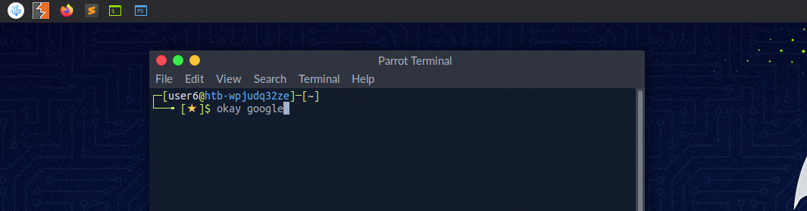
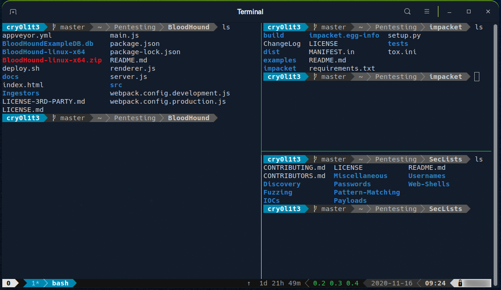

1. [Page 3](javascript: void\(0\);)
2. Introduction to Shell

# Introduction to Shell

---

It is crucial to learn how to use the Linux shell, as there are many servers based on Linux. These are often used because Linux is less error-prone as opposed to Windows servers. For example, web servers are often based on Linux. Knowing how to use the operating system to control it effectively requires understanding and mastering Linux’s essential part, the `Shell`. When we first switched from Windows to Linux, does it look something like this:

A Linux terminal, also called a `shell` or command line, provides a text-based input/output (I/O) interface between users and the kernel for a computer system. The term console is also typical but does not refer to a window but a screen in text mode. In the terminal window, commands can be executed to control the system.

We can think of a shell as a text-based GUI in which we enter commands to perform actions like navigating to other directories, working with files, and obtaining information from the system but with way more capabilities.

---

## Terminal Emulators

Terminal emulation is software that emulates the function of a terminal. It allows the use of text-based programs within a graphical user interface (`GUI`). There are also so-called command-line interfaces (`CLI`) that run as additional terminals in one terminal. In short, a terminal serves as an interface to the shell interpreter.

Imagine you're in a large office building where the shell is the main server room that processes all the company's data and commands. The terminal is like a receptionist's desk that serves as a point of communication to the server room. You go to the receptionist (terminal) to deliver instructions or requests to the server room (shell).

Now, suppose you're working remotely. Terminal emulation software acts like a virtual receptionist's desk on your computer screen (the GUI), allowing you to interact with the server room without being physically present in the office. It emulates the function of the actual receptionist's desk, enabling you to use text-based programs and commands within a graphical environment.

Additionally, `command-line interfaces` (`CLI`) that run as additional terminals within one terminal are like having multiple virtual receptionist desks open on your screen simultaneously. Each one allows you to send different instructions to the server room independently, but through the same main interface. In essence, the terminal serves as your gateway to communicate with and control the core operations managed by the shell.

Terminal emulators and multiplexers are beneficial extensions for the terminal. They provide us with different methods and functions to work with the terminal, such as splitting the terminal into one window, working in multiple directories, creating different workspaces, and much more. An example of the use of such a multiplexer called Tmux could look something like this:

---

## Shell

The most commonly used shell in Linux is the `Bourne-Again Shell` (`BASH`), and is part of the GNU project. Everything we do through the GUI we can do with the shell. The shell gives us many more possibilities to interact with programs and processes to get information faster. Besides, many processes can be easily automated with smaller or larger scripts that make manual work much easier.

Besides Bash, there also exist other shells like [Tcsh/Csh](https://en.wikipedia.org/wiki/Tcsh), [Ksh](https://en.wikipedia.org/wiki/KornShell), [Zsh](https://en.wikipedia.org/wiki/Z_shell), [Fish](https://en.wikipedia.org/wiki/Friendly_interactive_shell) shell and others.